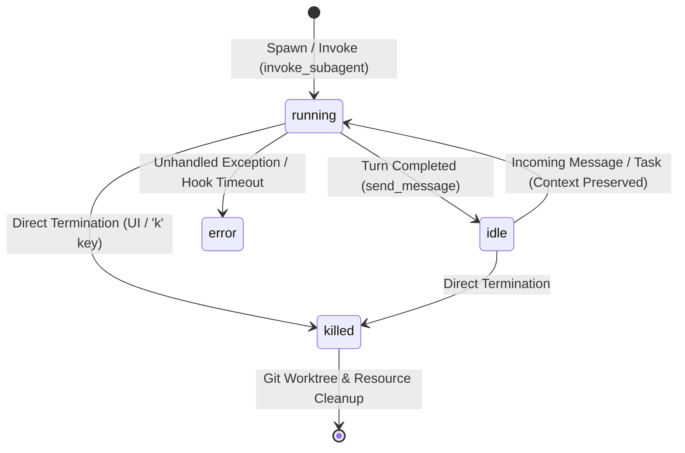

<!-- Generated by scripts/build.ts from reference/ — do not edit by hand. -->

# Google Antigravity Ecosystem: Complete Technical Reference, Schema Specification, and Gap Analysis

## Version 8.10 — Empirical Grounding of Rules, Glob Syntax, and Workflow Files (agy 1.1.12)

**Live verification date:** 2026-08-13  
**Live binary:** `agy 1.1.12`  
**Platform:** macOS Darwin 25.4.0 / arm64  
**Host status:** user-configured, not clean install

---

## What This Is

A comprehensive, source-classified reference for every schema, path, configuration key, command, tool, and behavioral specification across the entire **Google Antigravity Ecosystem**:

1. **Antigravity 2.0** — Standalone desktop application (`~/.gemini/antigravity/`).
2. **Antigravity IDE** — VS Code-fork agentic IDE (`~/.gemini/antigravity-ide/`).
3. **Antigravity CLI** — Lightweight terminal interface (`~/.gemini/antigravity-cli/`).
4. **Antigravity SDK** — Python SDK for agent development & orchestration (`google-antigravity-sdk`).
5. **Shared Ecosystem Core** — Global customizations, skills, plugins, rules, and hooks (`~/.gemini/config/`).

This report answers three questions:

1. **What exists?** — Every configuration key, file path, command, tool argument, and schema in Antigravity CLI.
2. **What do the official docs tell you?** — Everything confirmed at `antigravity.google/docs/*`, with source attribution.
3. **What don't the official docs tell you?** — Behavioral gaps, undocumented contracts, community-sourced findings, and information that requires independent verification.

This version adds a live-system grounding pass against `agy 1.1.12` using evidence IDs (`EV-###`) and the source tag `[LIVE-1.1.12 · 2026-08-13]`.

## Changelog

| Version | Date | Summary |
|---|---|---|
| 1.0 | Initial | Original gap analysis with mixed-sourcing |
| 2.0 | Revision | Tier A/B/C classification applied; sourced vs unsourced separated |
| 3.0 | Major update | All official docs pages incorporated; 50+ sources; schemas expanded |
| 4.0 | Current | Source classification system (`[DOCS]`/`[GOOGLE]`/`[PROTOCOL]`/`[COMMUNITY]`); Sections 16-17 added; 35 commands; 25 behavioral gaps cataloged |
| 5.0 | 2026-08-11 | Live-doc verification run: headless `status` enum + exit codes resolved; `defaultApprovalMode` enum resolved; plugin `agents/` inconsistency confirmed; CLI brain path + transcript schema verified hands-on (new §18.1); Section 10 rebuilt with full flag/stream reference |
| 5.1 | 2026-08-11 | Full-brain transcript audit (`scripts/audit_transcripts.py`, 49,586 lines / 33 sessions): `type` enum expanded to 19 values (9 promoted with citations); `status` enum confirmed as `DONE`/`RUNNING`/`ERROR` (the `ACTIVE` guess superseded); evidence saved under `audits/` |
| 5.2 | 2026-08-13 | Automated schema extraction & validation toolkit created (`antigravity-schemas` / `agy-schema` CLI); 9 Pydantic v2 models + JSON Schemas + live system auditor + sync-doc verification implemented |
| 6.0 | 2026-08-13 | Full Ecosystem Expansion: Expanded scope across Antigravity 2.0 (Desktop app), Antigravity IDE (VS Code fork), Antigravity CLI, Antigravity SDK, and Shared Core (`config/`); updated path inventories and system models |
| 7.0 | 2026-08-13 | Complete 17 Native Schemas & Toolkit Architecture Edition: Built single-source `SchemaRegistry`, domain-locality `AuditReport`, contextual `DocSyncInspector`, added 4 new native models (`RuleFileSchema`, `CLIStateSchema`, `CLIHistoryEntrySchema`, `TrustedHooksSchema`), updated file references to `antigravity-reference.md`, and achieved 100% spec sync. |
| 7.1 | 2026-08-13 | **Live-system grounding pass:** replaced guessed schemas with empirically observed formats from `~/.gemini/`. `CLIHistoryEntrySchema` corrected to `{display, timestamp (int), workspace, conversationId, type}`. `TranscriptStepSchema` gained `created_at` and expanded `type` enum to include observed values (`CONVERSATION_HISTORY`, `LIST_DIRECTORY`, `RUN_COMMAND`, `VIEW_FILE`, `CHECKPOINT`). `parse_pbtxt_state` implemented migrations parsing and fixed section-name extraction. `SystemAuditor` expanded from 5 to all 17 schemas (added `audit_json_file`, `audit_history`, `audit_plugin_hooks`, `audit_ide_state`; fixed agent glob to `*/agent.md`). `doc_inspector` regex updated to support hyphenated field names. CLI `validate` gained `.jsonl` and `.pbtxt` handling. |
| 8.0 | 2026-08-13 | **Live-Grounded Revision against `agy 1.1.12`:** Added `[LIVE-1.1.12 · 2026-08-13]` source tag and evidence IDs (`EV-001`–`EV-018`). Replaced all prior `1.1.11` grounding with `1.1.12`. Corrected `agy agents` / `agy models` output-format conflict, `agy agents` workspace-agent scope, plugin component detection rules, plugin roots, plugin manifest schema, agent frontmatter notes, global skill roots, structured `/skills` and `/permissions` output, CLI state/history/trusted-hooks schemas, keybindings default absence, and CLI path inventory. Added official hook argument corrections and Projects documentation. Recorded five high-priority conflicts and one unresolved hook-firing confound. |
| 8.1 | 2026-08-13 | **Web-Validated Additions Edition:** Added official SDK architecture documentation (three-layer model, bundled Go harness over WebSockets, Inspect/Decide/Transform hook categories, multimodal input) `[DOCS]`/`[GOOGLE]`; documented `/export` CLI→Desktop handoff `[COMMUNITY]`, `/schedule` one-time-timer 900 s cap `[GOOGLE]`, Open VSX IDE extension marketplace `[COMMUNITY]`, and `agy`/`gemini` binary coexistence `[COMMUNITY]`; expanded §5.7 keybinding inventory from the live official CLI reference `[DOCS]` (Ctrl+D exit, Ctrl+O/Ctrl+R/Ctrl+A/Ctrl+E/Ctrl+Z undo/Ctrl+Shift+Z redo, Alt+J, Ctrl+K, page nav, `A` approve-all) and rejected a community claim that mislabeled `Ctrl+Z` as suspend; documented that CLI API-key auth is NOT supported (open feature request `google-antigravity/antigravity-cli#78`; Google staff 2026-06-29: use the SDK) while the SDK supports `GEMINI_API_KEY`/`api_key`; fixed `[DOOGLE]` tag typo and `Antigrativity` misspelling; saved master evidence file at `evidence/agy-1.1.12/evidence.md` (defines EV-019). |
| 8.2 | 2026-08-14 | **Schema Coverage Audit & Catalog Expansion:** added `WorkflowFrontmatterSchema` (`schemas/workflow.schema.json`, the 19th native schema) and fixed `hooks.schema.json` so `PreInvocation`/`PostInvocation`/`Stop` accept the documented plain handler list (matcher ignored) in addition to the matcher-group form; added hooks/workflow schema fixtures and the `workflow` auditor file type; recorded R-002 (schema coverage audit). |
| 8.3 | 2026-08-14 | **Rule & Config Validation Hardening:** rewrote `rule.schema.json` to accept both observed frontmatter keys (`trigger` community convention + legacy `activation`, e.g. the real `activation: always` in the self-customizer plugin rule), string-or-array `globs`, and no required fields (R-003 — real rule files are often frontmatter-less); auditor now treats frontmatter-less `.agents/rules/*.md` as valid; `mcp_config.schema.json` enforces a required transport (`command` or `serverUrl`) per official docs; `settings.schema.json` enumerates `general.defaultApprovalMode` (`default`/`auto_edit`/`plan`); `parseSimpleYaml` now parses YAML block scalars (`>`/`|`) so multi-line skill/rule descriptions round-trip; added rule/mcp/settings schema fixtures. |
| 8.4 | 2026-08-14 | **Official-Docs Verification & Works Cited Minimization:** re-verified every Google/community entry in §19 against the official docs inventory (`antigravity.google/llms.txt`) and live pages (`cli/install`, `cli/settings`, `cli/gcli-migration`, `skills`, `sdk/overview`, `ide/getting-started`, `cli/sandbox`); confirmed every kept non-official source backs claims the official docs do not cover (skill token costs, legacy config keys, CLI API-key auth status, SDK internals, Open VSX gaps, binary coexistence); dropped the three never-cited codelab sources (`getting-started-google-antigravity`, `sdd-agy-cli`, `antigravity-cli-hands-on`), shrinking §19 from 46 → 43 entries with sources 35-46 renumbered 32-43; renamed the source-archive snapshots and their `source:` frontmatter accordingly, regenerated the manifest, and updated §2 source ranges, badge indices (`[GOOGLE:35]`→`[GOOGLE:32]`, `[GOOGLE:38]`→`[GOOGLE:35]`), registry self-test (46→43), and UI counts (19 schemas / 43 sources). |
| 8.5 | 2026-08-14 | **Evidence Archive Expansion:** added 9 official-docs sources surfaced by `antigravity.google/llms.txt` to §19 — `cli/install`, `cli/gcli-migration`, `ide/rules`, `ide/workflows`, `sdk/mcp`, `sidecars`, `task-groups`, `tools`, `faq` (now 52 entries: docs #1-39, Google #40-44, protocol #45, community #46-52); renamed the 13 affected archive snapshots with their `source:` frontmatter, fetched the 9 new pages into `evidence/sources/docs/`, regenerated the manifest and §2 source ranges; updated badge indices (`[GOOGLE:32]`→`[GOOGLE:41]`, `[GOOGLE:35]`→`[GOOGLE:44]`), registry self-test (43→52), and UI counts (52 sources). |
| 8.6 | 2026-08-14 | **Evidence Archive Expansion II:** added 7 more official-docs sources to §19 — `cli/modes`, `cli/vim-editor-mode`, `cli/credits`, `ide/hooks`, `ide/settings`, `ide/plugins`, `ide/mcp` (now 59 entries: docs #1-46, Google #47-51, protocol #52, community #53-59); renamed the 13 affected archive snapshots with their `source:` frontmatter, fetched the 7 new pages into `evidence/sources/docs/`, regenerated the manifest and §2 source ranges; updated badge indices (`[GOOGLE:41]`→`[GOOGLE:47]`, `[GOOGLE:44]`→`[GOOGLE:50]`), registry self-test (52→59), and UI counts (59 sources). |
| 8.7 | 2026-08-14 | **Append-Only Numbering & Archive Completion:** adopted append-only §19 numbering — new sources get the next free numbers at the end of the list (documented in the §19 header) so existing entries and their snapshots are never renumbered again; archived the final `llms.txt` batch (9 CLI command pages `cli/commands/*`, `ide/overview`, `ide/getting-started`, `cli/overview`, `cli/features`, `cli/prompting`) as §19 entries #60-73 (now 73 entries); fetched the 14 pages into `evidence/sources/docs/`; registry self-test (59→73) and UI counts (73 sources). |
| 8.8 | 2026-08-14 | **Schema Verification Against Archived IDE Pages:** verified `hooks`/`rule`/`workflow` schemas against the newly-archived official `ide/hooks`, `ide/rules`, `ide/workflows` pages (S-043/S-033/S-034) with the repo's own validator — the exact documented hooks.json example (plain-list `PreInvocation`/`PostInvocation`/`Stop`, `enabled`, optional handler `type`, `timeout`) and workflow `title`+`description` frontmatter all validate; recorded R-005 (no schema changes required) and three new open items (global rules path `~/.gemini/GEMINI.md` vs `rules/` dirs, 12,000-char file limits, workflow `name` key). |
| 8.9 | 2026-08-14 | **Hook Payload Runtime Schema & 20-Schema Catalog Expansion:** added `HookPayloadSchema` (`schemas/hook_payload.schema.json`, the 20th native schema) covering stdin/stdout contracts across all five hook events (`PreToolUse`, `PostToolUse`, `PreInvocation`, `PostInvocation`, `Stop`) and reusable context/step definitions; updated §20.2 matrix table with item #20 and expanded target paths for agents/plugins; added §20 documentation note clarifying `$id` URI namespaces; updated test suite and integrity gates to 20 native schemas. |
| 8.10 | 2026-08-14 | **Rule Frontmatter, Glob Syntax, & Workflow Live Audit:** audited 6 real rule files and 13 real workflow files in `~/.gemini/antigravity/.agents/`; confirmed `trigger: always_on|model_decision|glob`, `activation: always`, glob syntax (curly brace expansion, recursive globbing, comma-delimited strings), and `$ARGUMENTS` workflow tokens; recorded research report R-006; resolved the §17 glob syntax gap. |

## How This Report Was Built

1. **Initial audit** — 22 search results retrieved and cross-referenced
2. **Progressive gap identification** — claims classified into Tier A/B/C
3. **Targeted retrieval** — official docs pages retrieved one by one to fill gaps
4. **Source classification** — every claim tagged with `[DOCS]`/`[GOOGLE]`/`[PROTOCOL]`/`[COMMUNITY]`
5. **Behavioral gap cataloging** — every undocumented behavioral question identified
6. **Iterative correction** — claims upgraded, downgraded, or corrected as new sources arrived (5 major revisions)
7. **Live-system grounding** — direct inspection of a user-configured `agy 1.1.12` installation on macOS, with evidence files and IDs

---

## Table of Contents

1. Executive Summary
2. Methodology and Source Classification
3. Product Ecosystem and Identity
4. Extensibility Architecture
5. Configuration System
6. Permissions Engine
7. Complete CLI Command Reference
8. Built-in Agent Tool API
9. Sandbox
10. Headless Mode
11. Browser Integration
12. Artifacts and Implementation Plans
13. Enterprise Features
14. Workspace Governance Recommendations
15. Complete Path Inventory
16. Information Sourced Outside Official Docs
17. Undocumented Behavioral Contracts
    17.1 High-Priority Live Conflicts (agy 1.1.12)
18. Remaining Hard Gaps
    18.1 Transcript Schema (verified hands-on, 2026-08-11)
19. Works Cited
20. Automated Schema Toolkit & 20 Native Schemas Reference Architecture
    20.1 Toolkit Architecture (SchemaRegistry, AuditReport, DocSyncInspector)
    20.2 Complete 20 Native Schema Matrix
    20.3 Detailed Pydantic Specifications & Usage Examples

---

## 1. Executive Summary

Google Antigravity CLI (`agy`) is a lightweight, terminal-first interface for directing autonomous coding agents, executing shell commands, and managing background subagents entirely from the keyboard. It is the terminal component of the broader Google Antigravity ecosystem, which also includes Antigravity 2.0 (standalone desktop application), Antigravity IDE, and the Antigravity SDK.

The platform's extensibility architecture is built on open, portable standards: Markdown files with YAML frontmatter for Skills, Agents, Rules, and Workflows; the Model Context Protocol (MCP) for tool integrations; and JSON configuration files for hooks and settings. This design ensures customizations are portable across Claude Code, Cursor, Codex CLI, and any other tool adopting the same standards.

This report documents every confirmed configuration key, path, schema, command, and behavioral specification available from official documentation (`antigravity.google/docs/*`), while clearly identifying information sourced from other channels and cataloging behavioral questions the official docs leave unanswered.

As of live `agy 1.1.12` grounding, the report also distinguishes between what the changelog/official docs claim and what the CLI actually does in a user-configured macOS environment.

---

## 2. Methodology and Source Classification

### Confidence Tiers

Every claim is classified:

| Tier | Label | Definition |
|---|---|---|
| **A** | **Confirmed by Sources** | Directly stated in a retrieved source. Safe to rely on for production decisions. |
| **B** | **Reasonable Inference** | Logically extrapolated from confirmed information. Validate before production reliance. |
| **C** | **Requires Independent Verification** | Not found in any retrieved source. Must be tested against a live installation. |

### Source Classification

Every claim is tagged with its source origin:

| Tag | Scope | Authority |
|---|---|---|
| `[DOCS]` / `[DOCS:NN]` | `antigravity.google/docs/*` (Source `#NN` in §19) | Official product documentation. Primary authority. |
| `[LIVE-1.1.12 · 2026-08-13]` | Direct observation of `agy 1.1.12` on user-configured macOS Darwin 25.4.0 / arm64 | Empirical evidence from a live install. Included when live behavior disagrees with docs/changelog or fills a gap. Cites `EV-###`. |
| `[GOOGLE]` / `[GOOGLE:NN]` | Other Google-owned sources (Codelabs, SDK repositories, announcement blogs; Sources `#47..51` in §19) | High reliability. May lag behind main docs or reflect legacy behavior. |
| `[PROTOCOL]` / `[PROTOCOL:NN]` | `modelcontextprotocol.io` (Source `#52` in §19) | Official MCP specification. Authoritative for MCP protocol details. |
| `[COMMUNITY]` / `[COMMUNITY:NN]` | Third-party sources (Sources `#53..59` in §19) | Variable reliability. Included only when official docs are silent. Explicitly called out. |
| `[INFERRED]` | Logical inference from confirmed data | Lowest authority. Always called out when used. |

Tag priority:

```text
[DOCS] > [LIVE-1.1.12 · 2026-08-13] > [GOOGLE] > [PROTOCOL] > [COMMUNITY] > [INFERRED]
```

Where `[DOCS]` and live observation disagree, the conflict is recorded explicitly.

### Evidence Model

This version introduces evidence IDs (`EV-###`) tied to live observations. Each major correction references its evidence ID, e.g. `EV-003`.

Raw evidence should be stored under:

```text
evidence/agy-1.1.12/
```

Recommended files:

```text
001-agy-version.txt
002-agy-h.txt
003-agy-agents.txt
004-agy-agents-json.txt
005-agy-plugin-h.txt
006-agy-plugin-list.json
007-settings.json
008-config.json
009-projects.json
010-trusted-hooks.json
011-state.json
012-history-head.jsonl
013-skills-json-excerpt.json
014-permissions-json.json
015-hooks-json.json
016-hook-probe-untrusted.txt
017-hook-probe-trusted.txt
```

Redaction policy:

- Replace `<HOME>` for user paths
- Remove OAuth tokens, API keys, `email`, private project IDs
- Remove authentication scopes unless necessary

### Evidence Quality Classification

Each evidence file is classified by rigor:

| Quality Tier | Evidence IDs | Description |
|---|---|---|
| **Strong** | EV-001–EV-005, EV-013, EV-019–EV-020 | Raw command + full unredacted terminal output; independently reproducible |
| **Moderate** | EV-006–EV-012, EV-014–EV-016 | Raw output with privacy redactions or structural summaries rather than verbatim copy |
| **Weak** | EV-017–EV-018 | Command summaries (not raw terminal sessions); results asserted rather than demonstrated via follow-up commands (superseded by EV-020 confound resolution) |

Claims based on Weak-tier evidence should be treated as **directional indicators** requiring independent reproduction, not as confirmed behavioral findings.

### How to Read This Report

- Claims tagged `[DOCS]` can be treated as authoritative product documentation.
- Claims tagged `[LIVE-1.1.12 · 2026-08-13]` reflect observed behavior from a specific user-configured install, not a clean install.
- Claims tagged `[GOOGLE]` are reliable but may reflect legacy (Gemini CLI) behavior that has changed in Antigravity CLI. Verify when possible.
- Claims tagged `[COMMUNITY]` represent third-party observations or recommendations. Treat as supplementary intelligence, not product specification.
- **Section 16** consolidates all information sourced outside official docs in one reference table.
- **Section 17** catalogs every behavioral question the official docs leave unanswered.
- **Section 17.1** catalogs live-observed high-priority conflicts.

---

## 3. Product Ecosystem and Identity

### 3.1 Product Family

Google Antigravity comprises four products `[DOCS]`:

| Product | Description | Interface |
|---|---|---|
| **Antigravity 2.0** | Standalone desktop application. Command center for managing multiple local agents, grouped projects, workspaces, and scheduled tasks. | GUI application |
| **Antigravity IDE** | Fully-featured agentic IDE with agent manager, artifacts, and deep codebase understanding. VS Code fork. | IDE |
| **Antigravity CLI** | Lightweight, fast, terminal-first surface for autonomous coding agents, shell execution, and background subagent management. | Terminal (`agy`) |
| **Antigravity SDK** | Python SDK for programmatic integration, custom agent prototyping, and automated evaluations. | Python API |

**IDE extension marketplace (2026-08-13):** Antigravity IDE does **not** use the official VS Code Marketplace; it sources extensions from the **Open VSX Registry** (Eclipse Foundation) `[DOCS]`. Compatibility is partial: extensions mirrored on Open VSX install and work (including some with the `ms-` publisher prefix, e.g. `ms-python`), but Microsoft-owned extensions absent from Open VSX (e.g. **C# Dev Kit** — confirmed unavailable via `microsoft/vscode-dotnettools#2557`) do not. First-hand reports describe manual VSIX installs from the official Marketplace as unreliable `[COMMUNITY]`. Evaluate extension availability on Open VSX before treating the IDE as a drop-in VS Code replacement.

### 3.2 CLI Technical Characteristics

- **Language:** Written in Go `[DOCS]`
- **Optimized model:** Gemini 3.5 Flash, optimized for the Antigravity harness `[GOOGLE]`
- **Architecture:** Asynchronous-first — subagents run in the background, allowing parallel parent/subagent execution `[DOCS]`; commands execute asynchronously `[GOOGLE]`
- **Binary:** `agy` for CLI `[DOCS]`; `antigravity` for desktop IDE `[GOOGLE]`
- **Config tree:** Uses `~/.gemini/` directory `[DOCS]`; reuse for backward compatibility is `[GOOGLE]`
- **Live grounding:** `agy --version` reports `1.1.12` `[LIVE-1.1.12 · 2026-08-13]`, platform `Darwin ... RELEASE_ARM64_T8103 arm64` `EV-001`.

### 3.3 System Requirements

| Platform | Requirement |
|---|---|
| **macOS** | macOS 12 (Monterey) minimum. Apple Silicon only (x86 NOT supported). Current + two previous versions with Apple security update support. |
| **Windows** | Windows 10 (64-bit) |
| **Linux** | glibc >= 2.28, glibcxx >= 3.4.25 (Ubuntu 20, Debian 10, Fedora 36, RHEL 8) |

**Source:** `[DOCS]`

### 3.4 Migration from Gemini CLI

Starting June 18, 2026, Gemini Code Assist IDE extensions and Gemini CLI stopped serving requests for consumer tiers `[GOOGLE]`. Enterprise subscriptions remain unaffected.

**Configuration migration mapping:** `[GOOGLE]`

| Configuration | Gemini CLI (Legacy) | Antigravity CLI (Current) |
|---|---|---|
| User settings | `~/.gemini/settings.json` | `~/.gemini/antigravity-cli/settings.json` |
| Global shared skills | `~/.gemini/skills/` | `~/.gemini/config/skills/` |
| Workspace project skills | `.gemini/skills/` | `.agents/skills/` |

**Binary coexistence:** Both `agy` and the legacy `gemini` binary can be installed and run side by side on the same machine — different binary names, separate configuration trees, no interference `[COMMUNITY]`. Verified by multiple independent migration guides during the June 18, 2026 deprecation window (aibuilderclub, harshrastogi.tech, how2shout). Useful for incremental script migration.

### 3.5 Model Ecosystem

`[DOCS]`

| Model | Free & AI Plus | AI Pro | AI Ultra | Enterprise |
|---|---|---|---|---|
| Gemini 3.6 Flash | Yes | Yes | Yes | Yes |
| Gemini 3.5 Flash | Yes | Yes | Yes | Yes |
| Gemini 3.1 Pro | Yes | Yes | Yes | Yes |
| Claude Sonnet 4.6 (thinking) | Yes | Yes | Yes | **No** |
| Claude Opus 4.6 (thinking) | Yes | Yes | Yes | **No** |
| GPT-OSS-120b | Yes | Yes | Yes | **No** |

**Nano Banana 2** is used internally for generative image tasks `[DOCS]`.

Model selection is "sticky" within a conversation `[DOCS]`.

### 3.6 Open Standards Foundation

The entire extensibility architecture is built on portable, open standards:

| Component | Format | Cross-Tool Portability | Source |
|---|---|---|---|
| **MCP** | Open protocol | Claude, ChatGPT, VS Code, Cursor, MCPJam | `[DOCS]` + `[PROTOCOL]` |
| **Skills** | `SKILL.md` with YAML frontmatter | Claude Code, Cursor, Codex CLI | `[DOCS]` confirms format; `[COMMUNITY]` confirms cross-tool portability |
| **Agents** | `.md` with YAML frontmatter | Same format pattern | `[DOCS]` |
| **Rules** | `.md` constraint files | Markdown — inherently portable | `[DOCS]` |
| **Workflows** | `.md` step sequences | Markdown — inherently portable | `[DOCS]` |

MCP is described as "an open-source standard" using a USB-C analogy for AI apps `[DOCS]`.

---

## 4. Extensibility Architecture

Antigravity CLI supports seven extensibility mechanisms.

### 4.1 Progressive Disclosure Engine

This is an officially documented three-phase design pattern `[DOCS]`:

| Phase | What Loads | When | Token Cost |
|---|---|---|---|
| **Phase 1 — Metadata** | `name` and `description` from YAML frontmatter | Session start | ~100 tokens per skill `[GOOGLE]` |
| **Phase 2 — Instructions** | Full `SKILL.md` body | Agent determines relevance | <5,000 tokens recommended `[GOOGLE]` |
| **Phase 3 — Resources** | `scripts/`, `examples/`, `resources/` subdirectories | On demand | Variable |

**Phase 1 token costs and Phase 2 size recommendations** come from the Agent Skills 101 Codelab `[GOOGLE]`, not from the official docs pages.

### 4.2 Skills System

**Definition:** Skills are an open standard for extending agent capabilities. A skill is a folder containing a `SKILL.md` file with instructions that the agent can follow `[DOCS]`.

Skills are agent-triggered — the model detects intent and dynamically loads relevant skills. Unlike System Prompts (always loaded), Skills load on demand `[DOCS]`.

**Paths:** `[DOCS]`

| Scope | Path |
|---|---|
| **Global** | `~/.gemini/config/skills/<skill-folder>/` |
| **Workspace** | `<workspace-root>/.agents/skills/<skill-folder>/` |

Note: `.agent/skills` (singular) supported for backward compatibility `[DOCS]`.

**Live-verified additional skill roots** `[LIVE-1.1.12 · 2026-08-13]`:

From `agy -p "/skills" --output-format json` `EV-012`:

```text
<HOME>/.gemini/config/skills/
<HOME>/.gemini/antigravity-cli/skills/
<HOME>/.gemini/config/plugins/<plugin>/skills/
<HOME>/.gemini/antigravity-cli/plugins/<plugin>/skills/
```

Corrected report statement:

> Antigravity CLI loads skills from both global skill roots and both plugin roots.

**SKILL.md Format:** `[DOCS]`

```
---
name: my-skill
description: Helps with a specific task. Use when you need to do X or Y.
---

# My Skill

Detailed instructions for the agent go here.

## When to use this skill
- Use this when...

## How to use it
Step-by-step guidance...
```

**Frontmatter Specification:** `[DOCS]`

| Field | Required | Default | Description |
|---|---|---|---|
| `name` | **No** | Folder name | Unique identifier (lowercase, hyphens) |
| `description` | **Yes** | — | What the skill does and when to use it |
| `metadata` | No | `{}` | Optional arbitrary metadata object `[LIVE-1.1.12 · 2026-08-13]` |
| `disable-slash-command` | No | `false` | Hides the skill from the `/` menu and `/name` resolution while leaving it discoverable and invocable by the model. Useful when a large skill library floods the command menu. Added in v1.1.12. `[DOCS]` |

**These are the only two required frontmatter fields for Skills.** Attributes such as `disable-model-invocation`, `argument-hint`, and `user-invocable` are not documented in official sources. For granular execution control, use Custom Agents (Section 4.3).

**Live-verified frontmatter addition** `[LIVE-1.1.12 · 2026-08-13]` `EV-012`:

```yaml
---
name: self-customize
metadata:
  category: Tooling
  version: 1.1.0
description: >-
  ...
---
```

**Model invocability:** `model_invocable` is now live-verified `[LIVE-1.1.12 · 2026-08-13]`. In structured `/skills` output, it is always present and observed as `true` or `false`.

**Tip:** Write descriptions in third person with keywords for recognition. Example: "Generates unit tests for Python code using pytest conventions." `[DOCS]`

**Folder Structure:** `[DOCS]`

```
.agents/skills/my-skill/
├── SKILL.md       # Main instructions (required)
├── scripts/       # Helper scripts (optional)
├── examples/      # Reference implementations (optional)
└── resources/     # Templates and other assets (optional)
```

**Progressive Disclosure Behavior:** `[DOCS]`

1. **Discovery:** Agent sees skill names and descriptions at session start
2. **Activation:** If relevant, agent reads full `SKILL.md` content
3. **Execution:** Agent follows instructions while working

Explicit mention of a skill by name ensures use, but is not required `[DOCS]`.

**Best Practices:** `[DOCS]`

- Keep skills focused — one skill per distinct task
- Write clear, specific descriptions
- Use scripts as black boxes — encourage `--help` first
- Include decision trees for complex skills

**Structured `/skills` output** `[LIVE-1.1.12 · 2026-08-13]`:

`command.data.skills[]` object schema:

```json
{
  "name": "self-customizer:self-customize",
  "description": "...",
  "path": "<HOME>/.gemini/config/plugins/self-customizer/skills/self-customize/SKILL.md",
  "plugin": "self-customizer",
  "builtin": false,
  "model_invocable": true
}
```

| Field | Presence |
|---|---|
| `name` | always |
| `description` | always |
| `path` | always |
| `builtin` | always |
| `model_invocable` | always |
| `plugin` | plugin skills only |

### 4.3 Custom Agents

**Definition:** Reusable persona definitions in Markdown format with YAML frontmatter. Define *who* the agent is (capabilities, tools, execution policy, model) rather than *what* to do `[DOCS]`.

Two creation paths:

1. **File-based:** `.agents/agents/<name>.md` — persistent, discoverable
2. **Tool-based:** `define_subagent` tool — ephemeral, session-scoped

**Discovery Locations:** `[DOCS]`

| Location | Path | Scope |
|---|---|---|
| Workspace | `.agents/agents/<name>.md` or `.agents/agents/<name>/agent.md` | Repository |
| Global | `~/.gemini/config/agents/<name>.md` or `.../agents/<name>/agent.md` | Machine-wide |
| Plugins | `plugins/<plugin_name>/agents/` | Bundled package |

**Frontmatter Specification:** `[DOCS]`

| Property | Type | Default | Description |
|---|---|---|---|
| `name` | string | **Required** | Unique identifier |
| `description` | string | **Required** | Used by planner to determine delegation |
| `tools` | string[] | `[]` | Permitted tools (e.g., `view_file`, `run_command`) |
| `mainAgent` | boolean | `true` | Allow selection as primary agent in chat |
| `subagent` | boolean | `true` | Allow invocation via `invoke_subagent` |
| `model` | string | `inherit` | Model tier (`inherit`, `flash`, `pro`) |
| `commandExecutionPolicy` | string | `sandbox` | Shell command policy (`off`, `auto`, `eager`, `sandbox`) |
| `mcpServers` | object[] | `[]` | Custom MCP servers for this subagent |
| `skills` / `plugins` | string[] | `[]` | Skill paths or plugin dependencies |

**Live-verified frontmatter notes** `[LIVE-1.1.12 · 2026-08-13]` `EV-011`:

- `skills` accepts both bare names and plugin-qualified paths:
  ```yaml
  skills:
    - plugins/mattpocock-skills/skills/code-review
    - plugins/superpowers/skills/receiving-code-review
  ```
  ```yaml
  skills:
    - file-search
    - obsidian-markdown
    - writing-clearly-and-concisely
  ```
- `model` accepts `inherit`, `flash`, and `pro` in live agent files. When `model: inherit` is declared `[DOCS]`:
  - It dynamically cascades to the calling parent agent's active runtime model.
  - If the parent agent specifies no override, it resolves to the root session model configured in `settings.json` or CLI flags (`--model`).
- `subagent: true` and `mainAgent: true` are **not** mutually exclusive; both were observed together.

**Discovery & Headless Parity Divergence:** `[DOCS]` / `[GOOGLE]`
- **Interactive TUI (`/agents`):** Dynamically scans `.agents/agents/` and workspace plugin paths (`plugins/*/agents/`) to present workspace-scoped agents in the picker UI.
- **Headless Operations (`agy -p --agent <name>`):** Scans globally installed agents (`~/.gemini/config/agents/`). To run workspace-scoped agents headlessly, specify the explicit relative or absolute path to the `.md` manifest.

**Known Issue (documented):** Misspelled tool names in the `tools` list may cause the subagent to hang. Fix planned `[DOCS]`.

**Example (`code-auditor.md`):** `[DOCS]`

```yaml
---
name: code-auditor
description: Specialized subagent for security audits, static analysis, and code quality reviews.
tools:
  - view_file
  - grep_search
  - run_command
subagent: true
mainAgent: false
model: pro
commandExecutionPolicy: sandbox
skills:
  - skills/security-checklist
---

# System Prompt
You are an expert security auditor and code reviewer.

# Review Guidelines
1. Perform thorough static analysis without altering files unless explicitly asked.
2. Flag potential injection flaws, unvalidated inputs, or hardcoded secrets.
3. Provide concise, actionable remediation steps.
```

**Built-in Subagents:** `[DOCS]`

| Name | Purpose | Invocation |
|---|---|---|
| `research` | Codebase research, file navigation, structural exploration | Via `invoke_subagent` |
| `browser` | Sandboxed web browser testing | Exclusively via `/browser` |
| `self` | Clone of calling agent with identical system instructions and toolsets | Via `invoke_subagent` |

**Subagent Lifecycle State Machine:** `[DOCS]` / `[GOOGLE]`



| State | Behavior |
|---|---|
| **Running** | Actively executing reasoning loops, tool calls, and subagent orchestration. Can be cancelled (`k` in CLI) or interrupted by parent. |
| **Idle** | Turn completed, paused awaiting parent agent or user input. Preserves full conversation context, working memory, and transcripts. |
| **Done** | Task completed successfully. Visible as `done` in the `/agents` panel. |
| **Error** | Subagent encountered an unhandled tool exception or hook timeout. Visible as `error` in the `/agents` panel. |
| **Killed** | Permanently terminated. Ephemeral Git worktrees and allocations are cleaned up; `.jsonl` transcripts remain in session logs. |

Note: The interactive `/agents` TUI panel surfaces active processes as `running`, `done`, `error`, and `killed`, while `idle` reflects the internal suspended execution state between conversational turns.

**Inline Tool Approvals in `/agents` Panel:** `[DOCS]`

When a subagent attempts a protected operation (e.g., modifying a file outside the sandbox or running a non-allowed command), the authorization prompt displays inline in the `/agents` panel. Press `a` to approve or `d` to deny directly from the list. This avoids context-switching between the subagent and the main session.

**Agent Switching Behavior:** `[DOCS]`

If you are currently inside an active conversation, switching custom agents via `/agents` automatically forks your current session. This creates a new conversation with the selected agent while preserving the original.

**Inter-Agent Communication:** `[DOCS]`

| Aspect | Detail |
|---|---|
| Routing | Via unique agent conversation IDs |
| Topology | Parent ↔ subagent, peer ↔ peer (if ID known) |
| Auto-Wake | Messages to idle subagents trigger re-awakening |
| Shared Transcripts | Agents can read each other's conversation transcripts |
| Nesting Limit | **Maximum 10 levels** (strictly enforced) |

**Permissions Inheritance:** `[DOCS]`

Subagents inherit terminal command prefixes, file read/write scopes, and sandbox settings from parent. Parent retains full access to subagent workspaces. Tool authorization requests bubble up to the main UI.

**Multi-Agent Teamwork:** `[DOCS]`

| Aspect | Detail |
|---|---|
| Command | `/teamwork-preview` |
| Availability | Ultra Plan ($200/mo) only |
| Status | Preview |
| Features | Error recovery, automatic retries, task coordination |

**Workspace Options:** `[DOCS]`

| Mode | Behavior |
|---|---|
| `inherit` | Read-only copy of parent workspace |
| `branch` | Isolated Git worktree (read-write, merge-back) |
| `share` | Direct access to parent workspace |

**Live `agy agents` scope correction** `[LIVE-1.1.12 · 2026-08-13]` `EV-004`:

```
Available agents:
code-reviewer
documentation-writer
self-auditor
```

Discovered sources:

| Agent | Source |
|---|---|
| `code-reviewer` | `<HOME>/.gemini/config/agents/code-reviewer/agent.md` |
| `documentation-writer` | `<HOME>/.gemini/config/agents/documentation-writer/agent.md` |
| `self-auditor` | `<HOME>/.gemini/config/plugins/self-customizer/agents/self-auditor.md` |

Corrected statement:

> `agy agents` lists **global and plugin-shipped agents only**.
>
> Workspace-scoped agents are **not** listed by `agy agents` and are **not** loaded by headless `-p --agent`.
>
> The interactive TUI `/agents` selector remains the only verified surface for discovering workspace agents.

### 4.4 Plugins

**Definition:** Namespaced bundles that group skills, rules, MCP servers, and hooks into a single package `[DOCS]`.

**Directory Structure (docs version):** `[DOCS]`

```
plugins/<plugin-name>/
├── plugin.json       # Required marker file
├── mcp_config.json   # Optional MCP server definitions
├── hooks.json        # Optional hooks definition
├── skills/           # Optional skills
│   └── <skill-name>/
│       └── SKILL.md
└── rules/            # Optional rules
    └── <rule-name>.md
```

**Directory Structure (live-verified component detection):** `[LIVE-1.1.12 · 2026-08-13]` `EV-007`

| Component | Live detection trigger |
|---|---|
| `skills` | root-level `skills/` directory |
| `agents` | root-level `agents/` directory |
| `commands` | root-level `commands/` directory |
| `hooks` | root-level `hooks.json` |
| `mcpServers` | root-level `mcp_config.json` |
| `rules` | documented, but **not** confirmed by `agy plugin list` |

`self-customizer` contains `rules/safety-guardrails.md`, but `agy plugin list` reported only `["skills", "agents", "hooks"]` — so `rules` was not surfaced despite existing.

**Manifest (`plugin.json`):** `[DOCS]`

```json
{
  "name": "my-custom-plugin"
}
```

The `name` field is **optional** — defaults to directory name.

**Live-observed manifest schema** `[LIVE-1.1.12 · 2026-08-13]` `EV-010`:

```json
{"name": "ponytail"}
```

```json
{"name": "product-management"}
```

```json
{
  "$schema": "https://antigravity.google/schemas/v1/plugin.json",
  "name": "self-customizer",
  "description": "Teaches antigravity-cli..."
}
```

```text
$schema      optional
name         observed in all manifests
description  optional
```

No other manifest keys were observed.

**Supported Components:** `[DOCS]` — Skills, Rules, MCP Servers, Hooks (4 components). **Verified hands-on 2026-08-11:** plugins also support `agents/` and `commands` components — the plugins page directory structure is **incomplete**.

**Agents component (verified hands-on):** The subagents page references `plugins/<plugin_name>/agents/` as a discovery location and the plugins page omits it — the **subagents page is correct**. Evidence chain: (1) `agy plugin list` reports `agents` as a component of installed plugins, e.g. `self-customizer` (source: `antigravity`), which ships `~/.gemini/config/plugins/self-customizer/agents/self-auditor.md`; (2) `agy agents` lists `self-auditor` alongside global agents — it is discoverable as a loadable agent. (Workspace-scoped `.agents/plugins/` agent discovery was **MEASURED 2026-08-11 — NOT surfaced on the CLI/headless surfaces**: a fixture workspace containing `.agents/plugins/marker-plugin/agents/marker-agent.md` and a plain `.agents/agents/workspace-control.md` was probed; `agy agents` run from inside that workspace listed only the three global/plugin agents, and headless `-p --agent <name>` for both fixture agents produced the default agent's generic reply — the marker system prompts never fired. `agy agents` also has no `--output-format json` mode. **Interactive TUI `/agents` DOES list workspace-scoped agents** (user-verified 2026-08-11) — discovery is surface-dependent: TUI = global + plugin + workspace; headless/CLI = global + plugin only, with silent fallback for anything else.)

**Commands component (observed):** Plugins imported from gemini-cli / claude-code carry a `commands` component (e.g. `ponytail`, `product-management`) — also absent from the plugins page.

**plugin.json `$schema`:** Installed antigravity plugins reference `https://antigravity.google/schemas/v1/plugin.json`. However, a live fetch of this URL returned an error — the schema endpoint is either not publicly hosted, requires authentication, or has not been published. Downgraded from `[B]` to `[C]`. The `$schema` field may be aspirational or internally hosted. `[LIVE-1.1.12 · 2026-08-13]`

**Management surface (verified hands-on):** `agy plugin <command>` — `list` (JSON: `imports[]` with `name`, `source` (`antigravity`/`gemini-cli`/`claude-code`), `importedAt`, `components[]`), `import [source]`, `install <target>` (supports `plugin@marketplace`), `uninstall`, `enable`, `disable`, `validate [path]`, `link`.

**Full `agy plugin` command surface** `[LIVE-1.1.12 · 2026-08-13]` `EV-005`:

```text
Usage: agy plugin <command> [arguments]

Commands:
  list                   List imported plugins
  import [source]        Import plugins from gemini or claude
  install <target>       Install a plugin (supports plugin@marketplace)
  uninstall <name>       Uninstall a plugin
  enable <name>          Enable a plugin
  disable <name>         Disable a plugin
  validate [path]        Validate a plugin
  link <mp> <target>     Generate link to a marketplace
  help                   Show this help
```

**`agy plugin list` output schema** `[LIVE-1.1.12 · 2026-08-13]` `EV-006`:

```json
{
  "imports": [
    {
      "name": "obsidian",
      "source": "claude-code",
      "importedAt": "2026-06-18T13:01:21Z",
      "components": ["skills"]
    }
  ]
}
```

Observed `source` values:

```text
antigravity
claude-code
gemini-cli
```

Observed `components` values across install:

```text
skills
agents
hooks
commands
mcpServers
```

**Discovery Paths:** `[DOCS]`

| Scope | Path |
|---|---|
| Workspace | `.agents/plugins/` or `_agents/plugins/` |
| Global | `~/.gemini/config/plugins/` |

**Live-verified second plugin root** `[LIVE-1.1.12 · 2026-08-13]` `EV-008`:

| Path | Role |
|---|---|
| `<HOME>/.gemini/config/plugins/` | Imported plugins shown by `agy plugin list` |
| `<HOME>/.gemini/antigravity-cli/plugins/` | Local/developer plugins such as `hello-world`, `provider-database-tools` |

`agy plugin list` did **not** list the `antigravity-cli/plugins/` plugins.

**Two distinct plugin registries** `[LIVE-1.1.12 · 2026-08-13]` `EV-009`:

- `agy plugin list` = imported plugins
- `~/.gemini/config/config.json` = enabled/disabled state for a broader plugin set

Names present in `config.json` but absent from `agy plugin list`:

```text
antigravity-history-ingest
chrome-devtools-plugin
data
google-antigravity-sdk
modern-web-guidance-plugin
okf-knowledge
presentations
superpowers
```

**Adding Plugins:** `[DOCS]`

| Method | Description |
|---|---|
| Bundled (Build with Google) | Browse from Customizations page |
| Manual | Place in workspace or global plugin directories |

**MCP Store (IDE and Desktop):** `[DOCS]`

In addition to manual `mcp_config.json` configuration, Antigravity 2.0 and Antigravity IDE provide an **MCP Store** — a searchable, curated catalog of MCP servers accessible via the MCP Manager UI (`Add MCP` button). The MCP Store handles installation, authentication configuration, and versioning without requiring manual JSON editing. Confirmed integrations in the store include Figma `[DOCS]`, Google Workspace (Gmail, Drive, Docs, Sheets, Slides, Calendar, Chat, People) `[GOOGLE]`, and 50+ other services.

Note: MCP Store installations may configure authentication differently than manual `mcp_config.json` entries. If a server works via the Store but not via manual config, check the Store's installed configuration for reference.

### 4.5 Model Context Protocol (MCP)

**Definition:** Open standard connecting AI agents to local developer tools, databases, file parsers, and remote APIs `[DOCS]` + `[PROTOCOL]`.

**Configuration Paths:** `[DOCS]`

| Scope | Path |
|---|---|
| Global | `~/.gemini/config/mcp_config.json` |
| Workspace | `.agents/mcp_config.json` |

**Configuration Structure:** `[DOCS]`

```json
{
  "mcpServers": {
    "sqlite-explorer": {
      "command": "node",
      "args": ["/usr/local/bin/sqlite-mcp-server.js"],
      "env": { "SQLITE_DB_PATH": "/var/data/app.db" }
    },
    "my-remote-server": {
      "serverUrl": "https://api.example.com/mcp/",
      "headers": { "Authorization": "Bearer YOUR_API_TOKEN" }
    }
  }
}
```

**Configuration Properties:** `[DOCS]`

*Transport (one required):*

| Property | Type | Transport | Description |
|---|---|---|---|
| `command` | string | Stdio | Path to executable |
| `serverUrl` | string | Remote | **Required** for SSE, Streamable HTTP, or websocket connections |

**Warning:** The official docs state that legacy fields `url` and `httpUrl` are not supported and that `serverUrl` must be used `[DOCS]`. However, Google's own Developer Knowledge MCP setup guide (`developers.google.com/...`) shows `httpUrl` in an Antigravity CLI configuration example `[GOOGLE]`. **This discrepancy needs independent verification.** Possible explanations: (1) `httpUrl` still works as a deprecated alias; (2) the Developer Knowledge page is outdated; (3) the `serverUrl` requirement applies only to certain transport types. If migrating from Gemini CLI, test both fields against your installed version.

*Optional:*

| Property | Type | Description |
|---|---|---|
| `args` | string[] | CLI arguments for Stdio |
| `env` | object | Environment variables. Supports `$VAR`, `${VAR}`, `${VAR:-default}`, `%VAR%` (Windows) |
| `cwd` | string | Working directory for Stdio |
| `headers` | object | Custom HTTP headers for remote servers |
| `authProviderType` | string | `"google_credentials"` for Google ADC |
| `oauth` | object | `{clientId, clientSecret}` for manual OAuth |
| `disabled` | boolean | Temporarily disable without removing |
| `disabledTools` | string[] | Withhold specific tools from model |
| `timeout` | number | Request timeout |

**Authentication:** `[DOCS]`

| Method | Configuration | Details |
|---|---|---|
| Google Credentials | `"authProviderType": "google_credentials"` | Requires `gcloud auth application-default login` |
| OAuth (DCR) | No additional config | Automatic for servers supporting Dynamic Client Registration |
| OAuth (Manual) | `"oauth": {"clientId": "...", "clientSecret": "..."}` | Redirect URI: `https://antigravity.google/oauth-callback` |
| Custom Headers | `"headers": {"Authorization": "Bearer ..."}` | For API keys or bearer tokens |

**OAuth Token Storage:** `~/.gemini/antigravity/mcp_oauth_tokens.json` `[DOCS]`. Auto-refresh on expiry; auto-remove on invalidation.

**MCP Permissions:** `[DOCS]`

| Target Pattern | Scope |
|---|---|
| `mcp(server/tool)` | Specific tool on specific server |
| `mcp(server/*)` | All tools on specified server |
| `mcp(*)` | Any MCP tool across all servers |

Unconfigured MCP tools default to Ask mode.

**Interactive MCP Manager & Resilience:** `/mcp` command `[DOCS]` / `[PROTOCOL]`.
- **Fault Isolation & Graceful Degradation:** If an external MCP server process disconnects, crashes, or times out, the error is isolated to that connector. The engine flags the server as degraded without terminating the active conversation session.
- **Management Interface:** View status rings, reload configurations, inspect latency logs, and trigger manual reconnections.

**MCP Store:** 50+ direct integrations including AlloyDB, BigQuery, Bigtable, Chrome DevTools, ClickHouse, Cloud SQL (MySQL/PostgreSQL/SQL Server), Dataplex, Figma, Firebase, **Google Workspace (Gmail, Drive, Docs, Sheets, Slides, Calendar, Chat, People API)** `[GOOGLE]`, GitHub, GitLab, GKE, Heroku, Linear, MongoDB, Neon, Netlify, Notion, PayPal, Perplexity, Pinecone, PostHog, Postman, Prisma, Redis, Stripe, Supabase, and more `[DOCS]`.

**SDK Integration:** Antigravity SDK auto-discovers servers from `.agents/mcp_config.json` `[DOCS]`.

### 4.6 Rules

**Definition:** Markdown files defining constraints or guidelines for agent behavior `[DOCS]`.

| Scope | Path | Details |
|---|---|---|
| **Global Context** | `~/.gemini/GEMINI.md` | Primary global constraint file; always active `[DOCS]` |
| **Global Rule Stores** | `~/.gemini/config/rules/`, `~/.gemini/antigravity-cli/rules/` | Global modular rules `[LIVE-1.1.12 · 2026-08-13]` |
| **Workspace Modular** | `<workspace-root>/.agents/rules/*.md` | Scoped rules with trigger/glob frontmatter `[DOCS]` |
| **Directory Scope** | `<dir>/GEMINI.md`, `<dir>/AGENTS.md` | Injected hierarchically walking up from CWD `[DOCS]` |
| **Plugin Rules** | `<plugin>/rules/*.md` | Loaded when parent plugin is enabled `[DOCS]` |

Backward compat: `.agent/rules` (singular) `[DOCS]`.

**Deduplication & Precedence:** Rules are automatically deduplicated across multiple inherited directory paths so each unique rule is loaded at most once per conversation session.

**Size Limit:** 12,000 characters per rule file `[DOCS]`.

**Activation Modes:** `[DOCS]`

| Mode | Behavior | Syntax & Evaluation |
|---|---|---|
| `Manual` | Activated via @ mention in prompt | Explicit user tag |
| `Always On` | Always injected into agent context | System prompt baseline |
| `Model Decision` | Agent dynamically activates rule | Semantic similarity against rule description |
| `Glob` | Injected when active files match pattern | Standard minimatch/gitignore patterns (e.g., `src/**/*.tsx`, `**/*.proto`, `!**/vendor/**`) |

**@ File References:** Relative paths resolve from rules file location; absolute paths resolve directly; otherwise relative to repository `[DOCS]`.

### 4.7 Workflows

**Definition:** Markdown files with title, description, and step sequences `[DOCS]`.

| Aspect | Detail |
|---|---|
| Invocation | `/workflow-name` |
| Scope | Global or Workspace |
| Composition | Workflows can call other workflows |
| Execution | Sequential; supports `// turbo` and `// turbo-all` non-interactive annotations |
| Management | Customizations panel |
| Size Limit | **12,000 characters** per workflow file `[DOCS]` |

**Distinction from Rules:** Rules = persistent context at prompt level. Workflows = structured sequences at trajectory level `[DOCS]`.

### 4.8 Lifecycle Hooks

**Definition:** Run custom scripts at specific points during the execution loop `[DOCS]`.

**Execution Ordering & Timeout Guarantees:** `[DOCS]` / `[PROTOCOL]`
- **Sequential Execution:** Multiple hooks registered for the same event execute sequentially in declared registration order.
- **Timeout Protection:** Each hook supports a `timeout` property in seconds (defaulting to **30 seconds**). Exceeded timeouts abort the hook with an error, preventing agent pipeline deadlocks.

**Configuration Paths:** `[DOCS]`

| Scope | Path |
|---|---|
| Workspace | `.agents/hooks.json` |
| Global | `~/.gemini/config/hooks.json` |

**Hook Schema:** `[DOCS]`

```json
{
  "my-linter-hook": {
    "PostToolUse": [
      {
        "matcher": "run_command",
        "hooks": [
          {
            "type": "command",
            "command": "./scripts/lint.sh",
            "timeout": 10
          }
        ]
      }
    ]
  },
  "safety-gate": {
    "enabled": false,
    "PreToolUse": [
      {
        "matcher": "run_command",
        "hooks": [{ "command": "./scripts/safety-check.sh" }]
      }
    ]
  }
}
```

**Hook Definition Fields:** `[DOCS]`

| Field | Type | Description |
|---|---|---|
| `enabled` | Boolean | Optional. `false` to disable without removing. Default `true`. |
| `PreToolUse` | Array | Before tool execution |
| `PostToolUse` | Array | After tool completion |
| `PreInvocation` | Array | Before model call |
| `PostInvocation` | Array | After model invocation |
| `Stop` | Array | When execution terminates |

**Confirmed Lifecycle Events:** `[DOCS]`

| Event | Description | Matcher Target |
|---|---|---|
| `PreToolUse` | Before tool execution | Tool name |
| `PostToolUse` | After tool completion | Tool name |
| `PreInvocation` | Before model call | N/A |
| `PostInvocation` | After model invocation | N/A |
| `Stop` | Execution terminates | N/A |

**Official Hooks documentation additions** `[DOCS]`:

- Events: `PreToolUse`, `PostToolUse`, `PreInvocation`, `PostInvocation`, `Stop`
- `PreInvocation`, `PostInvocation`, `Stop` ignore matcher
- Handler `type` defaults to `"command"`
- Handler `timeout` defaults to `30`
- Hook stdin common fields:

```text
conversationId
workspacePaths
transcriptPath
artifactDirectoryPath
modelName
```

- CLI transcript path officially confirmed:

```text
<app_data_dir>/brain/<conversationId>/.system_generated/logs/transcript.jsonl
```

For CLI:

```text
~/.gemini/antigravity-cli/brain/...
```

This resolves the stale docs path issue.

**Note:** Community sources reference `AfterAgent` and `AfterTool` event names `[COMMUNITY]`. These may be aliases for `PostInvocation` and `PostToolUse`. Discrepancy unresolved.

**Matcher Patterns:** `[DOCS]`

| Pattern | Behavior |
|---|---|
| `""` or `"*"` | Match all tools |
| `"run_command"` | Match exactly |
| `"run_command\|view_file"` | Match either |
| `"browser_.*"` | Regex prefix match |

**IPC:** JSON stdin/stdout. Non-zero exit from `PreToolUse` cancels execution `[DOCS]`.

**Live-verified gap — `/hooks` enumeration:** `[LIVE-1.1.12 · 2026-08-13]` `EV-016`

```bash
agy -p "/hooks" --output-format json
```

Result:

```json
{
  "name": "hooks",
  "data": {
    "hooks": []
  }
}
```

Even though valid files existed:

- `<HOME>/.gemini/config/plugins/self-customizer/hooks.json`
- `<HOME>/.gemini/config/plugins/i-have-adhd/hooks.json`
- controlled workspace `.agents/hooks.json`

**Live-verified gap — headless hook firing:** `[LIVE-1.1.12 · 2026-08-13]` `EV-017`, `EV-018`, `EV-020`

Hooks did not fire in `-p` mode across empirical probe runs:

- **EV-017 — untrusted workspace:** Marker file `MARKER MISSING`; agent completed command successfully.
- **EV-018 — trusted workspace:** Marker file `MARKER MISSING`; agent completed command successfully.
- **EV-020 — permission pre-granted (no permission skip):** Probe EV-020 tested headless mode without `--dangerously-skip-permissions`, pre-granting required permissions in `.agents/settings.json` and `.agents/permissions.json`. Hooks still failed to fire (`MARKER MISSING`).

**Confound Resolution:** Probe EV-020 resolved the confound, confirming the hook execution omission was not caused by `--dangerously-skip-permissions`. In `agy 1.1.12`, non-interactive headless print mode (`agy -p`) architecturally omits loading or executing workspace lifecycle hooks (`PreToolUse`, `PostToolUse`) defined in `.agents/hooks.json`.

### 4.9 Component Relationships

`[DOCS]`

| Component | Analogy | Nature | Loading |
|---|---|---|---|
| MCP Servers | "Hands" | Persistent external connections | Always connected |
| Skills | "Brains" | Ephemeral task definitions | On-demand |
| Rules | "Laws" | Global constraints | Always loaded |
| Workflows | "Playbooks" | Multi-step orchestrations | On-demand |
| Agents | "Personas" | Capability profiles | On invocation |
| Plugins | "Packages" | Bundled combinations | On installation |
| Hooks | "Guards" | Lifecycle interceptors | Event-triggered |

### 4.10 Antigravity SDK Architecture

`[DOCS]` — Official SDK overview at `antigravity.google/docs/sdk/overview`; announcement at `antigravity.google/blog/introducing-google-antigravity-sdk` `[GOOGLE]`; source at `github.com/google-antigravity/antigravity-sdk-python` `[DOCS]`.

**What it is:** The Antigravity SDK (`pip install google-antigravity`, Apache 2.0, research preview) is a Python framework that "extends the same core agent harness that powers the Antigravity CLI and Antigravity 2.0" `[DOCS]`. It is a **pre-packaged runtime**, not a loop-building kit: agent logic is decoupled from where it runs `[DOCS]`, and a remotely-hosted harness is on the roadmap with no application rewrite `[GOOGLE]`.

**Bundled runtime binary:** The SDK ships a compiled runtime binary inside platform-specific PyPI wheels — cloning the repo alone is insufficient; always install from PyPI `[GOOGLE]`. Per the developer guide by Google Cloud's Karl Weinmeister: *"The Python SDK interfaces with a bundled Go harness over WebSockets. The local Go harness runs the core agentic loop and manages sandboxed tool execution. Python acts as the control plane"* `[COMMUNITY]` (author: Google Cloud Developer Advocate; the transport detail corroborates the official "same core agent harness" statement `[DOCS]`).

**Three-layer architecture** `[GOOGLE]`:

| Layer | Purpose | Key Classes |
|---|---|---|
| Layer 1 — Simplified | High-level, batteries-included entry point | `Agent`, `LocalAgentConfig` |
| Layer 2 — Session | Stateful session: step history, context compaction, token tracking | `Conversation`, `ChatResponse`, `Step`, `ToolCall`, `AgentConfig`, `HookRunner`, `ToolRunner`, `TriggerRunner` |
| Layer 3 — Adapter | Transport/backend abstraction (local = WebSocket to Go harness; designed for future remote backends) | `Connection`, `ConnectionStrategy`, `LocalConnection` |

**Tool model [DOCS]:** four tool sources (built-in tools, custom Python functions, MCP servers, and agent skills) share a unified execution pipeline `[DOCS]`; they share one streaming infrastructure and one safety-policy set `[GOOGLE]`.

**Safety policies [DOCS]:** declarative, deny-by-default. Default `LocalAgentConfig` enables built-in tools but applies `confirm_run_command()` (shell execution denied unless approved); full autonomy via `policies=[policy.allow_all()]`. Rules composed with `from google.antigravity.hooks.policy import deny, allow, ask_user` `[DOCS]`; evaluation is priority-based. `CapabilitiesConfig.disabled_tools` *removes* a tool's JSON schema from the context window (token savings); `policy.deny()` *blocks at runtime* while keeping the tool visible `[COMMUNITY]`.

**SDK hooks — a distinct system from CLI JSON hooks:** The SDK defines three programmatic **hook categories** `[DOCS]`, enforced by the type system. This differs from the JSON configuration hooks of §4.8 (event-triggered scripts over stdin/stdout IPC) — two separate hook systems for two surfaces (SDK vs CLI); do not conflate them:

| Category | Blocking | Can modify? | Use | Example |
|---|---|---|---|---|
| **Inspect** | No | No | Observe events (logging, metrics, audit trails) | `PostToolCallHook` |
| **Decide** | Yes | No | Approve/deny (policies are built on this) | `PreToolCallDecideHook` |
| **Transform** | Yes | Yes | Reshape data in transit, error recovery | `OnToolErrorHook` |

Nine concrete lifecycle points `[DOCS]` (including session start, pre/post turn, pre/post tool call `[DOCS]`; others like tool-error recovery, user-interaction handling, context compaction, and decorator shortcuts are Google-sourced `[GOOGLE]`).

**Multimodal input** `[DOCS]`: pass images, PDFs, audio, and video alongside text prompts. `from_file("spec.pdf")` auto-detects type/MIME; content classes (`Image(data=..., mime_type=..., description=...)`) accept raw bytes; prompts are mixed lists of text + content classes.

**SDK authentication** `[GOOGLE]`: Application Default Credentials (ADC) by default; `GEMINI_API_KEY` env var or `api_key=` in `LocalAgentConfig`; Vertex mode via `vertex=True` + `project`/`location` (or `GOOGLE_GENAI_USE_VERTEXAI`, `GOOGLE_CLOUD_PROJECT`, `GOOGLE_CLOUD_LOCATION`). Community CI workflows commonly store the key as a secret named `ANTIGRAVITY_API_KEY` `[COMMUNITY]`. Default model: Gemini 3.5 Flash `[GOOGLE]`.

**Other capabilities:** streaming (accessing live model reasoning/output chunks as they are generated) `[DOCS]`, structured output utilizing Pydantic models `[DOCS]`, sub-agents (spawning child agents with independent tools and contexts to build multi-agent teams) `[DOCS]`, human-in-the-loop handlers (pausing execution to ask structured questions) `[DOCS]`, observability (turn and cumulative token usage, thinking traces) `[DOCS]`. Multi-cursor streaming, cascading safety policies, triggers, and thinking levels are `[GOOGLE]`.

---

## 5. Configuration System

### 5.1 Settings File

`~/.gemini/antigravity-cli/settings.json` `[DOCS]`

### 5.2 Sparse Persistence

The CLI writes only values that differ from system defaults. This keeps config files clean and forward-compatible. Updated defaults from Google are automatically inherited `[DOCS]`.

### 5.3 Configuration Precedence

Seven-level hierarchy confirmed for Gemini CLI `[GOOGLE]`. Antigravity CLI likely inherits:

| Level | Source | Scope |
|---|---|---|
| 1 | Default values | Hardcoded |
| 2 | System defaults file | `/etc/gemini-cli/system-defaults.json` (Linux), `C:\ProgramData\gemini-cli\system-defaults.json` (Windows), `/Library/Application Support/GeminiCli/system-defaults.json` (macOS). Overridable via `GEMINI_CLI_SYSTEM_DEFAULTS_PATH` |
| 3 | User settings | `~/.gemini/settings.json` |
| 4 | Project settings | `.gemini/settings.json` |
| 5 | System settings | `/etc/gemini-cli/settings.json` (Linux), `C:\ProgramData\gemini-cli\settings.json` (Windows), `/Library/Application Support/GeminiCli/settings.json` (macOS). Overridable via `GEMINI_CLI_SYSTEM_SETTINGS_PATH` |
| 6 | Environment variables | Shell variables, `.env` files |
| 7 | Command-line arguments | `agy --sandbox --model="Gemini 3.5 Flash"` |

### 5.4 Environment Variable Interpolation

String values support `$VAR_NAME`, `${VAR_NAME}`, `${VAR_NAME:-DEFAULT_VALUE}` `[GOOGLE]`. Each plugin can have its own `.env` file.

### 5.5 Complete settings.json Schema

#### Safety and Permissions `[DOCS]`

| Key | Type | Default | Options |
|---|---|---|---|
| `toolPermission` | string | `"request-review"` | `request-review`, `proceed-in-sandbox`, `always-proceed`, `strict` |
| `commandExecutionPolicy` | string | `"sandbox"` | `sandbox`, `auto`, `eager`, `off` |
| `artifactReviewPolicy` | string | `"asks-for-review"` | `asks-for-review`, `agent-decides`, `always-proceed` |
| `enableTerminalSandbox` | boolean | `false` | `true`, `false` |
| `allowNonWorkspaceAccess` | boolean | `false` | `true`, `false` |
| `trustedWorkspaces` | string[] | `[]` | Whitelist of authorized repository paths |

**Key Behavioral Semantics:** `[DOCS]` / `[GOOGLE]`
- **`commandExecutionPolicy` Containment Rings:**
  - `sandbox` *(Default)*: Enforces OS container isolation (`nsjail` on Linux, `sandbox-exec` on macOS, `AppContainer` on Windows). Uncontained commands require interactive approval.
  - `auto`: Autonomous execution for non-destructive commands (linters, test suites, builds). Destructive actions (`rm -rf`, `git push --force`) remain gated.
  - `eager`: Proactive, high-autonomy execution without confirmation prompts. Intended for automated CI pipelines.
  - `off`: Disables shell command tools (`run_command` rejected).
- **`artifactReviewPolicy` Blast Radius Evaluation:**
  - `asks-for-review` *(Default)*: Strict manual approval gate presenting all proposed file diffs.
  - `agent-decides`: Evaluates change complexity and blast radius. Small doc edits and scratch files proceed automatically; broad multi-file changes or deletions of core manifests require user confirmation.
  - `always-proceed`: Direct file modification without review prompts (for headless operations).
- **`toolPermission: "strict"` Classification:**
  - *Exempt Read Tools (No prompt):* `view_file`, `list_dir`, `find_by_name`, `grep_search`, `/status`, `/mcp`, `/skills`.
  - *Gated Non-Read Operations (Prompt required):* `run_command`, `write_to_file`, `replace_file_content`, `search_web`, `read_url_content`, and mutating external MCP tools.
- **`enableTerminalSandbox` Fail-Closed Guarantee:**
  - If the OS sandbox daemon or namespace capabilities are unavailable (e.g. unprivileged container), execution **fails closed** with a hard error rather than running unprotected. Interactive sessions display a critical prompt offering an explicit unsandboxed override.

#### Display and Rendering `[DOCS]`

| Key | Type | Default | Options |
|---|---|---|---|
| `colorScheme` | string | `"terminal"` | `light`, `solarized light`, `colorblind-friendly light`, `dark`, `solarized dark`, `colorblind-friendly dark`, `tokyo night`, `terminal` |
| `altScreenMode` | string | `"default"` | `default`, `always`, `never` |
| `notifications` | boolean | `false` | `true`, `false` |
| `showTips` | boolean | `true` | `true`, `false` |
| `showFeedbackSurvey` | boolean | `true` | `true`, `false` |
| `ui.language` | string | `"us"` | Interface language |
| `ui.footer.items` | string[] | standard items | Footer display widgets (`model-name`, `agent-profile`, `agent-state`, `context-used`, `token-count`, `artifacts`, `quota`, `quota-weekly`, `project-path`) |

#### Editor `[DOCS]`

| Key | Type | Default | Options |
|---|---|---|---|
| `editor` | string | `"auto"` | `auto`, `vim`, `emacs`, `nano`, or any binary |
| `editorMode` | string | `"default"` | `default`, `vim` |
| `vimInsertFirst` | boolean | `false` | `true`, `false` (requires `editorMode: "vim"`) |

#### Behavior `[DOCS]`

| Key | Type | Default | Options |
|---|---|---|---|
| `verbosity` | string | `"high"` | `high`, `low` |
| `runningLightSpeed` | string | `"medium"` | `fast`, `medium`, `slow`, `off` |
| `useG1Credits` | boolean | `false` | `true`, `false` (external builds only) |
| `enableTelemetry` | boolean | `true` | `true`, `false` |
| `model` | string | (unset) | Model display name + effort tier, e.g. `"Gemini 3.5 Flash (Low)"` |

- **`runningLightSpeed` Modes:** `fast` (high-cadence spinner), `medium` (default balanced cadence), `slow` (low-frequency for remote SSH/bandwidth saving), `off` (disables terminal animations for screen-readers and headless logs).

> **`model` (verified 2026-08-11 via live config diff + live probe `[GOOGLE]`/A):** Not listed on the antigravity.google settings page — discovered by inspecting and diffing live `~/.gemini/antigravity-cli/settings.json`. Confirmed hands-on: a headless `agy -p` run with **no** `--model` flag resolved the session's `Model Selection` to the configured value (`Gemini 3.5 Flash (Low)`), proving the key is the persisted default-model setting. Value format matches the documented `--model="Gemini 3.5 Flash"` flag format; effort tier (`Low`/`High`) is part of the value.

#### Custom Scripts `[DOCS]`

| Key | Type | Description |
|---|---|---|
| `title` | object | `{"type": "command", "command": "<path>"}` |
| `statusLine` | object | `{"type": "command", "command": "<path>", "padding": 0, "enabled": true, "stack_with_default": false}` |

#### Permissions `[DOCS]`

| Key | Type | Description |
|---|---|---|
| `permissions.allow` | string[] | Allowlist rules |
| `permissions.deny` | string[] | Denylist rules |
| `permissions.ask` | string[] | Asklist rules |

#### General (Gemini CLI confirmed) `[GOOGLE]`

| Key | Type | Default | Description |
|---|---|---|---|
| `general.preferredEditor` | enum | `undefined` | `vscode`, `vscodium`, `windsurf`, `cursor`, `zed`, `antigravity`, `sublimetext`, `lapce`, `nova`, `bbedit`, `vim`, `neovim`, `emacs`, `hx`, `emacsclient`, `micro` |
| `general.openEditorInNewWindow` | boolean | `false` | New window for VS Code-family |
| `general.vimMode` | boolean | `false` | Vim keybindings |
| `policyPaths` | array | `[]` | Additional policy files (requires restart) |
| `adminPolicyPaths` | array | `[]` | Additional admin policy files (requires restart) |

#### Live-Verified `settings.json` Example `[LIVE-1.1.12 · 2026-08-13]` `EV-013`

File path:

```text
<HOME>/.gemini/antigravity-cli/settings.json
```

Observed relevant keys:

```json
{
  "allowNonWorkspaceAccess": true,
  "altScreenMode": "always",
  "editor": "code",
  "model": "Gemini 3.6 Flash (Medium)",
  "notifications": true,
  "permissions": {
    "allow": [],
    "deny": []
  },
  "statusLine": {
    "type": "command",
    "command": "node <HOME>/.gemini/antigravity-cli/hooks/statusline-quota.mjs",
    "enabled": true
  },
  "title": {
    "type": "command",
    "command": "<HOME>/.gemini/antigravity-cli/scratch/title.sh"
  },
  "toolPermission": "always-proceed",
  "trustedWorkspaces": []
}
```

Notes:

- `model` value supports effort tier in parentheses.
- `statusLine` in this install is simpler than the full documented schema; `padding` and `stack_with_default` were absent.
- `permissions.allow` and `permissions.deny` confirmed live.

### 5.6 Status Line JSON Payload

Custom scripts receive this JSON via stdin `[DOCS]`:

| Field | Type | Description |
|---|---|---|
| `cwd` | string | Current working directory |
| `session_id` / `conversation_id` | string | Session identifier |
| `transcript_path` | string | Path to transcript log |
| `model` | object | `{id, display_name}` |
| `workspace` | object | `{current_dir, project_dir}` |
| `version` | string | CLI version |
| `context_window` | object | Token usage: `total_input_tokens`, `total_output_tokens`, `context_window_size`, `used_percentage`, `remaining_percentage`, plus `current_usage` sub-object (`input_tokens`, `output_tokens`, `cache_creation_input_tokens`, `cache_read_input_tokens`) |
| `exceeds_200k_tokens` | bool/null | Context > 200k flag |
| `product` | string | Application name |
| `quota` | object | Maps model/bucket IDs (e.g. `gemini-weekly`) to `{remaining_fraction, reset_time, reset_in_seconds}` |
| `agent_state` | string | `idle`, `thinking`, `working`, `tool_use`, `initializing` |
| `vcs` | object | `{type, branch, client, dirty}` — type: `git`, `jj`, or `hg` |
| `sandbox` | object | `{enabled, allow_network}` |
| `artifact_count` | int | Artifacts produced |
| `plan_tier` | string | Subscription tier |
| `email` | string | Authenticated user |
| `pending_input_count` | int | Queued messages |
| `tool_confirmation_pending` | bool | Confirmation dialog showing |
| `task_count` | int | Background tasks |
| `terminal_width` | int | Terminal width |
| `execution_mode` | string | `planning`, `fast` |
| `vim` | object | `{mode}` — `NORMAL`, `INSERT`, `VISUAL`, `VISUAL LINE` |

Title scripts receive the same payload `[DOCS]`.

### 5.7 Keybindings

**File:** `~/.gemini/antigravity-cli/keybindings.json` `[DOCS]`

**Live-verified default absence** `[LIVE-1.1.12 · 2026-08-13]`:

```text
<HOME>/.gemini/antigravity-cli/keybindings.json
```

Live check:

```text
No such file or directory
```

It appears only after custom keybinding changes.

**Format:** JSON mapping action strings to hotkey arrays. Empty array `[]` disables. Malformed entries fall back to defaults. Delete file to restore all defaults `[DOCS]`.

**Complete TUI Command Inventory:** `[DOCS]`

| Category | TUI Command | Default Hotkey(s) |
|---|---|---|
| Global | `cli.escape` | `Escape` |
| Global | `cli.exit` | `Ctrl+C` (empty prompt) |
| Global | `cli.clear_screen` | `Ctrl+L` |
| Prompt | `prompt.submit` | `Enter` |
| Prompt | `prompt.newline` | `Shift+Enter`, `Ctrl+J` |
| Prompt | `edit.open_editor` | `Ctrl+G` |
| Prompt | `clipboard.paste_image` | `Ctrl+V` |
| Prompt | `prompt.insert_file` | `@` |
| Navigation | `nav.scroll_line` | `↑`, `↓` |
| Navigation | `nav.scroll_half_page` | `Shift+Page Up/Down`, `Ctrl+U/D` |
| Navigation | `nav.scroll_top` | `Home` |
| Navigation | `nav.scroll_bottom` | `End` |
| Navigation | `nav.focus_top` | `>` |
| Navigation | `nav.focus_bottom` | `<` |
| Navigation | `nav.tab_forward` | `Tab` |
| Navigation | `nav.tab_backward` | `Shift+Tab` |
| Navigation | `nav.artifact_outline` | `t` |
| Confirmations | `confirm.approve` | `y` |
| Confirmations | `confirm.reject` | `n` |
| Confirmations | `confirm.approve_all` | `Shift+A` |
| Confirmations | `confirm.reject_all` | `Shift+R` |
| Confirmations | `confirm.preview` | `p` |
| Confirmations | `nav.confirm` | `Enter` |
| Confirmations | `nav.escape` | `Escape` |
| Confirmations | `nav.switch_button` | `Tab` |
| Editor & Text | `prompt.undo_text` | `Ctrl+Z` |
| Editor & Text | `prompt.redo_text` | `Ctrl+Shift+Z` |
| Editor & Text | `prompt.cursor_start` | `Ctrl+A` |
| Editor & Text | `prompt.cursor_end` | `Ctrl+E` |
| Editor & Text | `prompt.toggle_trajectory` | `Ctrl+O` |
| Editor & Text | `prompt.open_review` | `Ctrl+R` |
| Editor & Text | `prompt.teleport_agent` | `Alt+J` |
| Editor & Text | `prompt.fast_approve` | `Ctrl+K` |
| Global | `cli.exit` (empty prompt only) | `Ctrl+D` |
| Global | forward delete (non-empty prompt) | `Ctrl+D` |
| Navigation | `navigation.page_up` / `navigation.page_down` | `PgUp`/`Shift+↑`, `PgDn`/`Shift+↓` |
| Navigation | `navigation.left` / `navigation.right` | `←`/`→` (multipage panels) |
| Confirmations | approve-all (built-in) | `A` (Review Panel) |

**Keybinding verification note `[DOCS]` (2026-08-13, live official CLI reference):** this inventory was reconciled against the live keybinding tables at `antigravity.google/docs/cli/reference`. Community claims that `Ctrl+Z` suspends the CLI and that `e` (edit command), `Ctrl+Y` (yank), and `Ctrl+_`/`Ctrl+Shift+-` (undo) exist were **not** confirmed by the official reference: the official bindings map `Ctrl+Z` → `prompt.undo_text` and `Ctrl+Shift+Z` → `prompt.redo_text`, and `Ctrl+D` is `cli.exit` only when the prompt box is empty (forward delete otherwise).

**Artifact Heading Outline (v1.1.12):** Press `t` in the artifact viewer to open a heading outline. This allows quick scanning of long markdown documents and direct navigation to specific sections. `[DOCS]`

### 5.8 Context Rule Files `[DOCS]`

| File | Scope |
|---|---|
| `GEMINI.md` (project root) | Workspace context rules |
| `AGENTS.md` (project root) | Agent-specific rules |
| `~/.gemini/GEMINI.md` | Global context rules |

### 5.9 Interactive Settings `[DOCS]`

Type `/config` or `/settings`. Navigate with arrows. Enter to toggle. Escape to save. CLI flags override for session duration with warning indicator.

---

## 6. Permissions Engine

### 6.1 Macro Level

`toolPermission` setting controls broad authorization flow `[DOCS]`:

| Mode | Behavior |
|---|---|
| `request-review` | Prompts for write/bash/web tools (default) |
| `proceed-in-sandbox` | Auto-runs if sandboxed; otherwise prompts |
| `strict` | Prompts for all non-read tools |
| `always-proceed` | No prompts |

### 6.2 Fine-Grained Level

```json
{
  "permissions": {
    "allow": ["command(git)", "read_file(/var/log/app)"],
    "deny": ["command(rm -rf)", "command(sudo)"],
    "ask": ["command(*)", "execute_url(aws.amazon.com)"]
  }
}
```

**Precedence:** Deny > Ask > Allow `[DOCS]`.

### 6.3 Action Types `[DOCS]`

| Action | Target | Default |
|---|---|---|
| `read_file` | path or `*` | Ask (workspace auto-allowed) |
| `write_file` | path or `*` | Ask (workspace auto-allowed) |
| `read_url` | domain or `*` | Ask |
| `execute_url` | domain or `*` | Ask |
| `command` | prefix/regex or `*` | Ask |
| `unsandboxed` | prefix or `*` | Ask |
| `mcp` | server/tool or `*` | Ask |

### 6.4 Implicit Rules & Path Normalization `[DOCS]` / `[GOOGLE]`

- **Write Implies Read:** Allowing `write_file` auto-grants `read_file`.
- **Deny Read Implies Deny Write:** Denying `read_file` automatically blocks write operations on that path.
- **Canonical Path Resolution:** Target filesystem paths are fully resolved to their canonical location via `realpath` prior to evaluating allow/ask/deny rules.
- **Symlink Escape Prevention:** Symbolic links inside the workspace pointing to targets outside the workspace root are blocked to prevent path traversal escapes (`../`).
- **Cross-Platform Normalization:** Windows backslashes (`\`) are normalized to forward slashes (`/`), and drive letters (e.g., `C:/`) are standardized before matching against permission patterns. Equivalent paths reachable through multiple symlinks are deduplicated.

### 6.5 Default Behaviors `[DOCS]`

1. Workspace read/write = auto-allowed
2. Web browsing = Ask
3. Everything else = Ask

### 6.6 Browser Security `[DOCS]`

| Layer | Mechanism | Behavior |
|---|---|---|
| Denylist | Server-side (Google BadUrlsChecker) | Checked via RPC. Server unavailable = deny. Cannot be overridden. |
| Allowlist | Local text file | Initialized with `localhost`. Denylist takes precedence. |

### 6.7 Agent Settings (Desktop) `[DOCS]`

- **Terminal Command Auto Execution:** `Request Review` (default) or `Always Proceed`
- **Non-Workspace File Access:** Disabled by default. Agent limited to project folders + `~/.gemini/antigravity/`

### 6.8 Permission Inheritance `[DOCS]`

Subagents inherit terminal command prefixes, file scopes, and sandbox settings. Authorization requests bubble up to main UI.

### 6.9 Three Permission Scopes `[LIVE-1.1.12 · 2026-08-13]` `EV-015`

Permissions editor exposes three scopes.

| Scope | Backing file |
|---|---|
| `project` | workspace-level permissions |
| `shared` | `<HOME>/.gemini/config/config.json → userSettings.globalPermissionGrants` |
| `global` | `<HOME>/.gemini/antigravity-cli/settings.json → permissions` |

Interactive `/permissions`:

```text
Permissions — Global
Permissions — Shared with Antigravity
Permissions — Project
```

Structured `/permissions`:

```json
{
  "name": "permissions",
  "data": {
    "permissions": [
      {"scope": "project"},
      {"scope": "shared", "allow": [], "deny": []},
      {"scope": "global", "allow": [], "deny": []}
    ]
  }
}
```

`command.data.permissions[]` object shape:

```text
scope: "project" | "shared" | "global"
allow?: string[]
deny?: string[]
ask?: string[]
```

`project` may appear with no arrays when empty:

```json
{"scope": "project"}
```

```text
global<TAB>allow
global<TAB>deny
shared<TAB>allow
shared<TAB>deny
```

### 6.10 Granular Permission Rule Grammar DSL `[LIVE-1.1.12 · 2026-08-13]` `EV-013`, `EV-015`

Authorization rule strings in `allow`, `deny`, and `ask` arrays follow a structured Domain-Specific Language (DSL):

| Rule Pattern | Target Tool / Scope | Description | Live Examples |
|---|---|---|---|
| `unsandboxed(<path_or_cmd>)` | `run_command` | Executes specified command directly on the host OS, bypassing sandbox isolation containers. | `unsandboxed(/opt/homebrew/bin/gws)`, `unsandboxed(git status)` |
| `command(<cmd_prefix>)` | `run_command` | Authorizes execution of commands matching the leading prefix string. | `command(git add)`, `command(git commit)`, `command(ls)` |
| `read_url(<domain_or_pattern>)` | `read_url_content` / Web | Authorizes HTTP text fetching and browser egress to specified host domains. | `read_url(antigravity.google)`, `read_url(docs.pieces.app)` |
| `mcp(<server>/<tool>)` | MCP Tool Dispatch | Authorizes or restricts specific Model Context Protocol tool operations. | `deny: ["mcp(chrome-devtools-mcp/list_pages)"]` |
| `read_file(<path_pattern>)` | `view_file` / Core | Denies or allows reading files matching sensitive workspace path patterns. | `deny: ["read_file(/path/.opencode)"]` |

---

## 7. Complete CLI Command Reference

35 confirmed slash commands:

### Core `[DOCS]`

| Command | Alias | Description |
|---|---|---|
| `/exit` | `/quit` | Close TUI |

### Conversations `[DOCS]`

| Command | Alias | Description |
|---|---|---|
| `/resume` | `/switch`, `/conversation` | Browse, search, resume past conversations |
| `/fork` | `/branch` | Clone conversation or fork to different project |
| `/rename <name>` | — | Rename session |
| `/rewind` | `/undo` | Roll back to previous message |
| `/export` | — | Push the current terminal session into the Antigravity 2.0 desktop GUI to continue the same conversation in a richer surface (file diffs, graph views) `[DOCS]` |

### Configurations `[DOCS]`

| Command | Alias | Description |
|---|---|---|
| `/config` | `/settings` | Interactive settings editor |
| `/model` | — | Choose reasoning model |
| `/fast` | — | Enable fast mode |
| `/planning` | — | Enable planning mode |
| `/keybindings` | — | Keyboard shortcut editor |

### Agent Control `[DOCS]`

| Command | Alias | Description |
|---|---|---|
| `/agents` | — | Agent selection, discovery, subagent monitoring |
| `/browser` | — | Open sandboxed Chrome browser |
| `/goal` | — | Run until task is completely finished without intermediate input |
| `/grill-me` | — | Before implementing, ask clarifying questions to align on plan details |
| `/schedule` | — | Run instruction as one-time timer or recurring schedule. **One-time timers capped at 15 minutes (900 s)** `[GOOGLE]`; cron-style recurring schedules have a separate (unspecified) limit `[GOOGLE]` |

### Tools and Tasks `[DOCS]`

| Command | Alias | Description |
|---|---|---|
| `/codesearch` | `/cs`, `/search` | Interactive code search with regex and line commenting |
| `/hooks` | — | Browse active hooks |
| `/mcp` | — | Interactive MCP manager |
| `/permissions` | — | Fine-grained permissions editor |
| `/skills` | — | Browse loaded skills |
| `/tasks` | — | Task Manager Panel for background logs |

### Utilities `[DOCS]`

| Command | Alias | Description |
|---|---|---|
| `/add-dir` | — | Add working directory |
| `/artifact` | — | Open artifact picker |
| `/btw` | — | Provide additional context |
| `/clear` | — | Clear terminal history |
| `/context` | — | Inspect memory and token usage |
| `/copy` | — | Copy content to clipboard |
| `/diff` | — | Workspace diff viewer |
| `/open <path>` | — | Open in default editor |
| `/feedback` | — | Feedback submission |
| `/title` | — | Toggle/configure terminal titles |
| `/statusline` | — | Configure custom status line |

### Account `[DOCS]`

| Command | Alias | Description |
|---|---|---|
| `/credits` | — | Manage AI Premium credits |
| `/logout` | — | Disconnect, purge auth tokens |
| `/usage` | `/quota` | View model quota |

### Special Input `[DOCS]`

| Input | Description |
|---|---|
| `! <command>` | Direct bash execution (shell mode) |
| `@ <path>` | File autocompletion overlay |


### Binary Subcommands

| Command | Description |
|---|---|
| `agy agents` / `agy agent` | List available agents. **Live 1.1.12:** lists global + plugin-shipped agents only; does **not** list workspace agents. |
| `agy models` | List available models |
| `agy plugin` / `agy plugins` | Manage plugins: list, import, install, uninstall, enable, disable, validate, link |
| `agy changelog` | Show changelog and release notes |
| `agy install` | Configure environment paths and shell settings |
| `agy update` | Update CLI |

**Live conflict — `--output-format` on `agents` / `models`** `[LIVE-1.1.12 · 2026-08-13]`:

The 1.1.12 changelog says:

> Added machine-readable output to the `models` and `agents` subcommands through an `--output-format` flag accepting `json` and `stream-json`.

Live CLI contradicts this.

`EV-002`:

```bash
agy agents --output-format json
```

```text
Error: flags provided but not defined: -output-format
```

`EV-003`:

```bash
agy models --output-format json
```

```text
Error: flags provided but not defined: -output-format
```

Both `stream-json` attempts fail identically.

Corrected report statement:

> As of live `1.1.12`, `agy agents` and `agy models` do **not** implement `--output-format`, despite the changelog.

**Full `agy plugin` command surface** `[LIVE-1.1.12 · 2026-08-13]` `EV-005`:

```text
Usage: agy plugin <command> [arguments]

Commands:
  list                   List imported plugins
  import [source]        Import plugins from gemini or claude
  install <target>       Install a plugin (supports plugin@marketplace)
  uninstall <name>       Uninstall a plugin
  enable <name>          Enable a plugin
  disable <name>         Disable a plugin
  validate [path]        Validate a plugin
  link <mp> <target>     Generate link to a marketplace
  help                   Show this help
```

---

## 8. Built-in Agent Tool API

> [!NOTE]
> The official documentation lags the live CLI. While the official docs document only 18 tools, the live CLI exposes a complete set of **56 tools** (verified via the headless `stream-json` `init` event's `tools` array as of 2026-08-11).
> Tool argument signatures are only officially verified for the original 18 tools plus official hook tool argument corrections from 2026-08-13. The remaining tools are verified by name, but their argument signatures are unverified (and thus no parameters are specified to avoid hallucinations).
> Description provenance follows the same rule: the verified tools have descriptions sourced from official docs and observed transcripts; name-verified tools carry best-effort descriptions inferred from their tool names. The knowledge JSON flags this per tool (`args_verified`, `description_verified`) so agents can weigh each entry.

### File Operations (`file` family)

| Tool | Arguments | Args Verified | Description |
|---|---|---|---|
| `list_dir` | `DirectoryPath` (string) | Yes | List directory |
| `multi_replace_file_content` | `TargetFile` (string), `Instruction` (string), `Description` (string), `ReplacementChunks` (array), `TargetLintErrorIds` (array), `ArtifactMetadata` (object) | Yes | Multiple non-contiguous edits |
| `replace_file_content` | `TargetFile` (string), `Instruction` (string), `Description` (string), `AllowMultiple` (bool), `TargetContent` (string), `ReplacementContent` (string), `StartLine` (int), `EndLine` (int), `TargetLintErrorIds` (array) | Yes | Replace text block |
| `sed_file` | — | No | Perform regex replacements in a file |
| `view_file` | `AbsolutePath` (string), `StartLine` (int), `EndLine` (int), `ContentOffset` (int), `IsSkillFile` (bool) | Yes | Read file ranges |
| `write_to_file` | `TargetFile` (string), `Overwrite` (bool), `CodeContent` (string), `Description` (string), `IsArtifact` (bool), `ArtifactMetadata` (object) | Yes | Write files |

### Search and Research (`search` family)

| Tool | Arguments | Args Verified | Description |
|---|---|---|---|
| `find_by_name` | `SearchDirectory` (string), `Pattern` (string), `Type` (string), `Excludes` (array), `Extensions` (array), `FullPath` (bool), `MaxDepth` (int) | Yes | Glob search |
| `grep_search` | `SearchPath` (string), `Query` (string), `IsRegex` (bool), `CaseInsensitive` (bool), `Includes` (string), `MatchPerLine` (bool) | Yes | Text search |
| `search_web` | `query` (string), `domain` (string) | Yes | Web search |
| `read_url_content` | `Url` (string) | Yes | Fetch URL content. **Correction:** official args use `Url`, not `URL`. |

### Execution and System (`execution` family)

| Tool | Arguments | Args Verified | Description |
|---|---|---|---|
| `call_mcp_tool` | `ServerName` (string), `ToolName` (string), `Arguments` (object) | Yes | Lazy MCP tool execution |
| `delete_knowledge` | — | No | Delete a knowledge file or memory entry |
| `generate_image` | `Prompt`, `ImageName`, `ImagePaths?` | Yes | Generate an image using the internal Nano Banana model |
| `run_command` | `CommandLine` (string), `Cwd` (string), `WaitMsBeforeAsync` (int), `RunPersistent` (bool), `RequestedTerminalID` (string) | Yes | Execute bash |

### Control and Safety (`control` family)

| Tool | Arguments | Args Verified | Description |
|---|---|---|---|
| `ask_permission` | `Action` (string), `Target` (string), `Reason` (string) | Yes | Request permissions |
| `ask_question` | `questions` | Yes | Ask the user one or more multiple-choice questions |
| `command_status` | — | No | Check the status of a running background command |
| `finish` | — | No | Mark the current goal/task as successfully completed |
| `list_permissions` | (no args) | Yes | View current grants |
| `manage_task` | `Action` (`list`/`kill`/`status`/`send_input`), `TaskId?`, `Input?` | Yes | Background task control |
| `schedule` | `DurationSeconds?`, `CronExpression?`, `MaxIterations?`, `Prompt` | Yes | Timers and cron jobs. One-time `DurationSeconds` capped at 900 (15 min) per official Google Cloud tutorial `[GOOGLE]` |
| `send_command_input` | — | No | Send input text to a running background task |
| `wait` | — | No | Wait for a specified condition or duration |
| `wait_5_seconds` | — | No | Wait exactly 5 seconds |

### Agent Collaboration (`collaboration` family)

| Tool | Arguments | Args Verified | Description |
|---|---|---|---|
| `define_subagent` | `name`, `description`, `system_prompt`, `enable_mcp_tools?`, `enable_write_tools?`, `enable_subagent_tools?` | Yes | Create transient subagent template |
| `invoke_subagent` | `Subagents[]` with `Prompt`, `Role`, `TypeName`, `Workspace?` | Yes | Spawn subagent |
| `manage_inbox` | — | No | Manage user-queued messages and system notifications |
| `manage_subagents` | `Action`, `ConversationIds?` | Yes | Manage background subagents |
| `send_message` | `Message` (string), `Recipient` (string) | Yes | Inter-agent / subagent messaging |

### Resources (`resources` family)

| Tool | Arguments | Args Verified | Description |
|---|---|---|---|
| `list_resources` | — | No | List resources exposed by loaded MCP servers |
| `read_resource` | — | No | Read contents of a loaded MCP resource |

### Notebooks (`notebook` family)

| Tool | Arguments | Args Verified | Description |
|---|---|---|---|
| `notebook_edit` | — | No | Edit code cells in a Jupyter notebook |
| `notebook_execution` | — | No | Execute cells in a Jupyter notebook |

### Browser Automation (`browser` family)

| Tool | Arguments | Args Verified | Description |
|---|---|---|---|
| `browser_click_element` | — | No | Click an element on the active browser page |
| `browser_drag_pixel_to_pixel` | — | No | Drag from one pixel coordinate to another |
| `browser_get_dom` | — | No | Retrieve the DOM structure of the active page |
| `browser_get_network_request` | — | No | Get detailed info for a specific network request |
| `browser_input` | — | No | Input text into a browser input field |
| `browser_list_network_requests` | — | No | List network requests captured for the active page |
| `browser_mouse_down` | — | No | Trigger a mouse down event at coordinates |
| `browser_mouse_up` | — | No | Trigger a mouse up event at coordinates |
| `browser_move_mouse` | — | No | Move the mouse to specific coordinates |
| `browser_press_key` | — | No | Press a key or key combination on the page |
| `browser_refresh_page` | — | No | Refresh the active browser page |
| `browser_resize_window` | — | No | Resize the browser window dimensions |
| `browser_scroll` | — | No | Scroll the browser window by an offset |
| `browser_scroll_dom` | — | No | Scroll a specific DOM element by selector |
| `browser_select_option` | — | No | Select an option from a dropdown element |
| `browser_subagent` | — | No | Invoke the browser subagent |
| `capture_browser_console_logs` | — | No | Retrieve console logs from the active page |
| `capture_browser_screenshot` | — | No | Take a screenshot of the active browser window |
| `click_browser_pixel` | — | No | Click specific pixel coordinates on the screen |
| `execute_browser_javascript` | — | No | Execute arbitrary JavaScript on the active page |
| `list_browser_pages` | — | No | List all active pages/tabs in the browser profile |
| `open_browser_url` | — | No | Open a URL in the browser profile |
| `read_browser_page` | — | No | Read text/HTML content of the active page |

---

## 9. Sandbox
[DOCS:06]

Enforces native operating system process isolation, manages execution containment boundaries, and protects local workstation environments from unauthorized remote calls or destructive terminal operations `[DOCS:06]`.

### Native OS Containment Rings `[DOCS:06]`

| Platform | Sandboxing Technology | Filesystem Containment | Network Egress Policy |
|---|---|---|---|
| **Linux** | `nsjail` | Kernel namespaces (`CLONE_NEWNS`, `CLONE_NEWUSER`), cgroups v2 resource bounds, read-only system root (`/`), private workspace mount | Network namespace unsharing (`CLONE_NEWNET`) isolates network stack; raw outbound sockets blocked. |
| **macOS** | `sandbox-exec` (Seatbelt / SBPL) | Scheme-based policy profiles (`.sb`) enforcing `(allow file-read*)` and `(allow file-write* (subpath <workspace>))` | `(deny network-outbound)` blocks unauthorized outbound socket connections. |
| **Windows** | `AppContainer` | Low-integrity restricted token, workspace DACL access grants, isolated registry namespace | Network client capabilities restricted via AppContainer security attributes. |

### Sandbox Activation & Security Guarantees `[DOCS:06]`

Sandboxing is configured inside global preferences (`~/.gemini/antigravity-cli/settings.json` or `~/.gemini/settings.json`):

```json
{
  "enableTerminalSandbox": true
}
```

- **`enableTerminalSandbox`** (boolean, default: `false`): Restricts all local terminal tools and execution commands launched by agents to OS containment rings.
- **Fail-Closed Security Guarantee:** If the underlying OS sandbox binary or namespace capabilities are missing (e.g. inside an unprivileged Docker container lacking namespace privileges), execution **fails closed** with a hard error rather than silently executing unprotected `[DOCS:06]` / `[GOOGLE:47]`.
- **Symlink Escape Prevention:** Symlinks within the project directory pointing to targets outside the workspace root are blocked to prevent directory traversal escapes (`../`) `[DOCS:06]` / `[GOOGLE:47]`.

### Interactive Approval Behavior `[DOCS:06]`

When an agent attempts shell tool execution, the TUI prompt adapts dynamically to your sandboxing state:

- **Sandbox Enabled**: Prompt offers a temporary escape option:
  1. *Yes*
  2. *Yes, and run without sandbox restrictions* (bypasses containment exclusively for that single run)
  3. *No*
- **Sandbox Disabled**: Prompt allows forcing containment for a high-risk command:
  1. *Yes*
  2. *Yes, and run in sandbox* (forces single-execution containment ring)
  3. *No*

---

## 10. Headless Mode

`[DOCS]` — Re-verified against live docs 2026-08-11 and live `agy 1.1.12` 2026-08-13.

**Run flags:** `-p`, `--print`, `--prompt`

**Full flag reference:**

| Flag | Default | Description |
|---|---|---|
| `-p`, `--print`, `--prompt` | — | Run a single prompt non-interactively and print the response |
| `--output-format` | `text` | `text`, `json`, or `stream-json` |
| `--json-schema` | — | Schema string, `.json` file path, or primitive type name (`string`, `number`, `integer`, `boolean`) |
| `--model` | — | Model slug for the run (list with `agy models`) |
| `--effort` | — | Reasoning effort: `low`, `medium`, `high` |
| `--agent` | — | Agent for the run (list with `agy agents`) |
| `--continue`, `-c` | `false` | Continue the most recent conversation |
| `--conversation` | — | Resume a conversation by ID |
| `--dangerously-skip-permissions` | `false` | Auto-approve all tool permission requests |
| `--print-timeout` | `5m` | Maximum time to wait for a response |
| `--sandbox` | `false` | Run with terminal sandbox restrictions enabled |
| `--add-dir` | `[]` | Add a directory to the workspace (repeatable) |
| `--disable-slash-commands` | `false` | Disable slash command and skill expansion in print mode |
| `--log-file` | — | Override CLI log file path |
| `--mode` | — | Agent execution mode: `accept-edits`, `plan` |
| `--prompt-interactive`, `-i` | — | Run an initial prompt interactively and continue the session |

**Status enum (complete, re-verified):**

| Status | Meaning |
|---|---|
| `SUCCESS` | Run completed and produced a response |
| `ERROR` | Run ended with an error |
| `CANCELED` | Run was canceled |
| `INTERRUPTED` | Run was interrupted (e.g., SIGINT) |
| `INVALID` | Run reached an invalid state |
| `WAITING` | Run ended while waiting on input |
| `RUNNING` | Run did not reach a terminal state |

**Exit codes:** `0` on success; non-zero when no response is produced (reason written to stderr). In `json`/`stream-json` modes, failures also surface in the `status` and `error` fields. Pinning an unknown `--model` exits non-zero with `ERROR` — no silent fallback.

**Note on `--agent` (verified hands-on 2026-08-11 and live 1.1.12):** unlike `--model`, `--agent` does **not** reject unknown names in headless mode — a run with `--agent definitely-not-an-agent` succeeds silently with the default agent. Custom agents (including plugin-shipped ones) are discoverable via `agy agents`. Headless loading of **workspace-scoped** custom agents was **MEASURED 2026-08-11 and does not occur**: a fixture workspace's plugin agent (`marker-agent`) and plain workspace agent (`workspace-control`) both returned the default agent's generic reply under `-p --agent <name>` — their marker system prompts never fired, and unknown names fall back silently too. Global plugin agents (e.g. `self-auditor`) are the only custom agents confirmed to load (interactive session, transcript `a1e51ef2`). Note the surface split: the interactive TUI `/agents` selector **does** list workspace-scoped agents (user-verified 2026-08-11); only headless `--agent` and `agy agents` ignore them.

**Live `agy agents` scope correction** `[LIVE-1.1.12 · 2026-08-13]` `EV-004`: `agy agents` lists global and plugin-shipped agents only. Workspace agents are not listed and not loaded by headless `-p --agent`. The interactive TUI `/agents` selector remains the only verified surface for discovering workspace agents.

**JSON Envelope (`--output-format json`):**

| Field | Type | Presence |
|---|---|---|
| `conversation_id` | string | Always |
| `status` | string | Always (see status enum) |
| `response` | string | Always |
| `error` | string | Failure only |
| `duration_seconds` | number | Always |
| `num_turns` | number | Always |
| `structured_output` | object | With `--json-schema` only |
| `json_schema` | object | With `--json-schema` only |
| `usage` | object | `input_tokens`, `output_tokens`, `thinking_tokens`, `cache_read_tokens`, `total_tokens` |
| `command` | object | Read-only slash commands only `[LIVE-1.1.12 · 2026-08-13]` |

**Command object addition** `[LIVE-1.1.12 · 2026-08-13]`:

Read-only slash commands in print mode now include a `command` object. Observed for:

```text
/skills
/permissions
/hooks
```

Example:

```json
{
  "conversation_id": "",
  "status": "SUCCESS",
  "response": "...",
  "duration_seconds": 0,
  "num_turns": 0,
  "usage": {
    "input_tokens": 0,
    "output_tokens": 0,
    "thinking_tokens": 0,
    "cache_read_tokens": 0,
    "total_tokens": 0
  },
  "command": {
    "name": "skills",
    "data": {}
  }
}
```

These commands consume zero quota.

**Structured `/permissions` output** `[LIVE-1.1.12 · 2026-08-13]` `EV-015`:

```text
command.data.permissions[]:
scope: "project" | "shared" | "global"
allow?: string[]
deny?: string[]
ask?: string[]
```

**Structured `/skills` output** `[LIVE-1.1.12 · 2026-08-13]` `EV-012`:

```text
command.data.skills[]:
name: string
description: string
path: string
builtin: boolean
model_invocable: boolean
plugin?: string
```

**Streaming (`--output-format stream-json`):** Newline-delimited JSON (NDJSON) events: `init` (once), `step_update` (per step transition or text delta), `result` (once, same shape as `json`). `step_update` payloads carry `state` (`ACTIVE`/`DONE`), `step_type` (`user_input`, `agent_response`, `tool`, `checkpoint`), `tool_name`, `text_delta`, `usage`, `tool_info` (`name`, `parameters`, `output`, `error{type,message}`), and `subagent_info` (`subagents` with `type_name`, `role`, `conversation_id`, `log_uri`, `workspace_uris`). The `init` payload records `cwd`, `tools`, `permission_mode` (`request-review` default; `always-proceed` under `--dangerously-skip-permissions`), and optional `model`/`agent`/`json_schema`.

**Permissions in headless:** No interactive prompts exist. Tools requiring approval are soft-denied: the run continues, exits `0`, and prints a stderr notice naming the tool. Pre-grant via `permissions.allow` rules in `~/.gemini/antigravity-cli/settings.json`, or auto-approve with `--dangerously-skip-permissions`. Workspace reads/writes are auto-allowed.

**Subcommands:** `agy models` lists model slugs (e.g., `gemini-3.6-flash-high`, `gemini-3.6-flash-medium`, `gemini-3.5-flash-medium`, `gemini-3.1-pro-high`, `claude-sonnet-4-6`); `agy agents` lists available agents (global + plugin-shipped); `agy plugin` manages plugins; see Section 7 for the full subcommand inventory. Note: `agy models` and `agy agents` can hang in some contexts (observed 2026-08-11) — likely awaiting a network call. **Live 1.1.12 conflict:** neither `agy agents` nor `agy models` accepts `--output-format`, despite the changelog explicitly claiming "Added machine-readable output to the `models` and `agents` subcommands through an `--output-format` flag accepting `json` and `stream-json`" (v1.1.12 changelog, confirmed verbatim). This is a confirmed changelog-vs-binary inconsistency.

**Authentication:** Cached credentials (OAuth) required. Non-interactive environments without cached credentials get `authentication required` error. **API-key authentication is NOT supported by the CLI as of 2026-08-13:** feature request `google-antigravity/antigravity-cli#78` (open) proposes `GEMINI_API_KEY`/`ANTIGRAVITY_API_KEY` env detection and a `--api-key` flag; a Google staff comment (2026-06-29) states "Gemini API Key is not supported currently... For using an API key in Antigravity you can use the SDK." Community guides showing `export ANTIGRAVITY_API_KEY=...` for the CLI `[COMMUNITY]` should be treated as unverified — the same variable **is** used in SDK-based CI workflows (e.g. the `run-agy-sdk` GitHub Action) `[COMMUNITY]`, where the officially documented env var is `GEMINI_API_KEY` `[GOOGLE]` (see §4.10).

**Project flag:** `--project=<project_id>` combinable with headless mode. **Official Projects documentation** `[DOCS]`:

- Default project: `default-cli-project`
- Open session in specific project: `agy --project=<project_id>`
- Create new project: `agy --new-project`
- Resumed conversations automatically use their stored project.
- Fork conversation: `/fork <project_id>`

### 10.1 Workspace Hooks Omission in Headless Mode

**Workspace hooks omission** `[LIVE-1.1.12 · 2026-08-14]` `EV-020`:
Headless print mode (`agy -p` / `--print`) does **not** load or execute workspace lifecycle hooks (`PreToolUse`, `PostToolUse`) defined in `.agents/hooks.json`, regardless of permission flags or configuration settings.

- **Confound Resolution (EV-017 / EV-018 vs. EV-020):** Initial headless hook probes EV-017 (untrusted workspace) and EV-018 (trusted workspace) established that workspace hooks failed to fire, but both probes supplied `--dangerously-skip-permissions`. This created a critical confound: did `--dangerously-skip-permissions` actively bypass hook evaluation, or is headless mode inherently missing hook execution support? Probe **EV-020** resolved this by executing headless print mode without `--dangerously-skip-permissions`, pre-granting tool permissions via configuration files (`.agents/settings.json` and `.agents/permissions.json`).
- **Empirical Findings:** The tool (`run_command`) executed successfully without blocking (status `SUCCESS`, 1 turn, duration 3.3s), but workspace hooks failed to fire (`MARKER MISSING`). Supplementary probe EXP-02a with an absolute path shell command hook produced identical results.
- **Architectural Property:** Hook omission in `agy 1.1.12` is an architectural property of the headless print-mode engine — non-interactive execution bypasses workspace hook listener registration and event dispatch entirely. Automation that relies on workspace hooks for pre-execution guardrails or post-execution logging cannot depend on them in headless mode.

---

## 11. Browser Integration
[DOCS:23]

Google Antigravity includes a local Chrome browser integration operated via a specialized Browser Subagent to test websites, inspect documentation sources, capture visual screenshots, and automate web tasks `[DOCS:23]`.

### Core Browser Architecture & Profile Isolation `[DOCS:23,26]`

| Aspect | Technical Specification |
|---|---|
| **Engine** | Local Chrome browser operated via Browser Subagent. |
| **Profile Isolation** | Runs inside a completely separate Chrome profile (isolated application instance). |
| **Data Privacy** | No cookie or sign-in credential sharing with personal browsing profiles. |
| **Sign-In Persistence** | Account sign-ins persist inside the isolated profile across future sessions. |
| **OS Windowing** | On macOS, appears as a separate dock icon if Chrome is already open. |
| **Profile Path** | Configurable via the **Browser Profile** setting in the Browser User Settings section. |
| **Toggle Control** | Completely disabled by toggling **Browser Tools** under User Settings → Browser. |

### Two-Layer URL Security Model `[DOCS:24]`

Browser navigation enforces a mandatory two-layer URL security system:

1. **Denylist (Server-Side Enforced)**:
   - Evaluated using Google Superroots' `BadUrlsChecker` service via RPC before navigation.
   - Denies access to malicious or dangerous URLs.
   - **Fail-Closed**: If the server is unreachable, access is denied by default.
   - **Absolute Precedence**: The denylist always overrides the allowlist; a denylisted URL cannot be allowlisted.

2. **Allowlist (Local User Control)**:
   - Stored in a local text file, initialized with `localhost`.
   - When navigating to an un-allowlisted URL, the UI displays an **"Always Allow"** confirmation prompt.
   - Clicking "Always Allow" appends the target host to the local allowlist.

### Invocation & Artifact Output `[DOCS:23,27]`

- **Invocation**: Triggered explicitly via the `/browser` command or spawned via subagent.
- **Design Rationale**: Kept as an explicit command/subagent invocation rather than auto-triggered because automated browser usage requires user steering.
- **Artifact Deliverables**: Tab actions generate visual screenshot artifacts and WebP action video recordings saved directly to the session artifact directory.

---

## 12. Artifacts and Implementation Plans
[DOCS:13]

Artifacts are structured deliverables created by agents to communicate progress, outline technical plans, present code diffs, render architecture diagrams, and capture visual media `[DOCS:13]`. As agents execute with high autonomy over long sessions, artifacts serve as the primary asynchronous co-steering mechanism.

### Execution Modes `[DOCS:13]`

| Mode | Command | Execution & Planning Behavior |
|---|---|---|
| **Planning Mode** | `/planning` | Agent generates structured implementation plans, task groups, and architecture artifacts before executing filesystem changes. |
| **Fast Mode** | `/fast` | Direct execution mode without intermediate planning halts. |

### TUI Interactive Review Interface `[DOCS:22]`

When an agent produces or modifies artifacts, the TUI status bar displays an active notification (`/artifact to review`). Pressing `Ctrl+R` opens the interactive review interface:

1. **Artifact Picker Panel Overlay**:
   - A high-level checklist menu featuring status markers (`✓ approved`, `open`), quick preview toggles, and folder structures.
2. **Artifact Detail Viewer**:
   - A full-screen audit interface supporting syntax highlighting, inline line-level commenting, and diagram scaling.

#### Panel Keybindings `[DOCS:22]`

| Key | TUI Command | Action Behavior |
|---|---|---|
| `↑` / `↓` | `nav.scroll_line` | Navigate through list of artifact entries. |
| `h` / `l` | `nav.switch_button` | Toggle row action buttons (**open**, **approve**, **reject**). |
| `p` | `confirm.preview` | Toggle 12-line inline code preview under selected row. |
| `y` | `confirm.approve` | Instantly approve selected artifact. |
| `n` | `confirm.reject` | Instantly reject selected artifact. |
| `Shift+A` | `confirm.approve_all` | Approve all pending artifacts simultaneously. |
| `Esc` | `nav.close` | Close picker overlay. |

### Artifact Review Policy Settings `[DOCS:22]`

The Desktop Hub and CLI support configurable review policies:

| Policy | Behavior |
|---|---|
| **Request Review** *(Recommended)* | Agent halts at intermediate milestones for user inspection before writing changes to disk. |
| **Always Proceed** | Agent proceeds continuously without halting for deliverable approvals. |

### Implementation Plan Co-Steering Workflow `[DOCS:28]`

1. **Generate**: Agent creates an `implementation_plan.md` artifact in the session artifact directory.
2. **Review & Comment**: User inspects proposed architecture, adding line-level feedback comments.
3. **Co-Steer**: User selects **"Proceed"** (approves implementation) or **"Review"** (requests revision based on feedback).
4. **Multimodal Feedback**: Screenshots captured by browser subagents are attached as visual artifacts supporting direct region-based feedback.

---

## 13. Enterprise Features
[DOCS:18]

Google Antigravity integrates directly with **Gemini Enterprise** and the **Gemini Enterprise Agent Platform**, enabling enterprise development teams to run sessions using models hosted within their organization's Google Cloud infrastructure under strict corporate governance and VPC Service Controls `[DOCS:18]`.

### Supported Products & Licensing Tiers `[DOCS:18]`

| Product | Enterprise Integration Status |
|---|---|
| **Antigravity 2.0** (Desktop) | Supported. |
| **Antigravity CLI** (`agy`) | Supported. |
| **Antigravity IDE** | Not supported for enterprise deployments. |

**Supported License Editions**:
- Gemini Enterprise Standard
- Gemini Enterprise Plus
- Gemini Enterprise Pay-as-you-go

### IAM Roles & Permissions Matrix `[DOCS:18]`

| Action / Setup Step | Required IAM Role | Permission ID |
|---|---|---|
| **Create GCP Project** | Project Creator (`roles/resourcemanager.projectCreator`) | `resourcemanager.projects.create` |
| **Enable Agent Platform API** | Service Usage Admin (`roles/serviceusage.serviceUsageAdmin`) | `serviceusage.services.enable` |
| **Use Antigravity Models** | Agent Platform User (`roles/aiplatform.user`) | `aiplatform.user` |

### Authentication & Single Sign-On (SSO) `[DOCS:18]`

1. **Standard Business SSO**: Sign in with corporate business account via Google Cloud SSO.
2. **Workforce Identity Federation (BYOID / WIF)**: Authenticate through external identity providers (e.g. Okta, Ping) via **Advanced WIF Configuration** string.
3. **Application Default Credentials (ADC)** *(CLI Only)*:
   - Authenticate headless workflows via `gcloud auth application-default login --project {PROJECT}`.
   - Credential path: `~/.config/gcloud/application_default_credentials.json`.
   - Enable via environment variable: `export AGY_ADC_AUTH=true`.
   - Limitation: Models older than Gemini 3 Flash are not supported under ADC.
4. **API Key Support**:
   - **CLI**: NOT supported currently (`google-antigravity/antigravity-cli#78` `[GOOGLE:50]`).
   - **SDK**: Supported via `GEMINI_API_KEY` env or `api_key=` config `[DOCS:30]`.

### Regional Deployment Endpoints & Capability Matrix `[DOCS:18]`

| Endpoint Region | Base URI | Supported Capabilities |
|---|---|---|
| **Global** | `global` | Text Generation, Code Inference, Multimodal, Image Generation. |
| **US Multi-Region** | `us` | Text Generation, Code Inference, Multimodal. |
| **EU Multi-Region** | `eu` | Text Generation, Code Inference, Multimodal. |

*Note*: Image Generation is available exclusively on `global` deployment endpoints.

### Projects, Conversations & Worktree Workflows `[DOCS:11,12]`

- **Default Project**: `default-cli-project`.
- **Project Selection**: `agy --project=<project_id>` or `agy --new-project`.
- **Cross-Project Forking**: `/fork <project_id>` forks an active conversation to another project.
- **Desktop Execution Modes**: Local Mode (direct in workspace directory) or New Worktree Mode (isolated git worktree).

### Diagnostic Log Paths `[DOCS:16]`

| Client Product | Diagnostic Log File Path |
|---|---|
| **Antigravity CLI** | `~/.gemini/antigravity-cli/cli.log` |
| **Antigravity 2.0** | `~/Library/Logs/Antigravity/language_server.log` |

---

## 14. Workspace Governance Recommendations
[DOCS:17]

To maximize development velocity while maintaining complete control, enterprise and local engineering teams should establish structured workspace governance paradigms aligned with official Antigravity CLI best practices `[DOCS:17]`.

### 1. Establish Local Verification Loops
- Ensure a workspace test suite or build script is defined before initiating agent tasks.
- Instruct agents to write test cases first, execute local verification scripts (e.g. `npm test`, `pytest`), and iterate on test outputs automatically.

### 2. Enforce the Three-Phase Execution Pattern `[DOCS:17,28]`
- **Exploration**: Direct the agent to explore codebase references and explain architecture before modifying code.
- **Planning**: Request a structured implementation plan artifact outlining file paths, dependencies, and logic overrides.
- **Execution**: Apply code edits only after reviewing and approving the implementation plan.

### 3. Maintain Codebase Rule Files `[DOCS:20]`
- Place a `GEMINI.md` or `AGENTS.md` file at the workspace root to define coding standards, styling paradigms, test flags, and deprecation notices.
- Agents automatically parse root rule files on startup to guide code generation.

### 4. Configure Structured Safety Barriers `[DOCS:03,07]`
Configure `~/.gemini/antigravity-cli/settings.json` based on team risk tolerance:

| Permission Preset | Behavior | Recommended Use |
|---|---|---|
| **`request-review`** | Prompts for confirmation before non-read operations. | Standard default mode. |
| **`proceed-in-sandbox`** | Confines terminal execution to an OS kernel sandbox ring (`enableTerminalSandbox: true`). | High-autonomy untrusted script execution. |
| **`strict`** | Always prompts for all write and shell actions with line-by-line transparency. | High-security enterprise repositories. |

### 5. Active Session Management & Branching `[DOCS:12,14]`
- **Immediate Escape Hatch (`Esc`)**: Interrupts active agent execution immediately if search or code generation deviates.
- **History Rollback (`/rewind` / `/undo`)**: Rolls back conversation thread and filesystem state to a stable prior baseline.
- **Parallel Speculative Branching (`/fork`)**: Forks a session to experiment with alternative implementations without polluting the main thread.

### 6. Non-Interactive Scripting & Subagent Fan-Out `[DOCS:05,10]`
- Use `agy -p "prompt"` for non-interactive one-shot CI/CD queries and git hook automation.
- Dispatch concurrent background subagents for large-scale multi-file refactoring without blocking the main TUI prompt.

---

## 15. Complete Path Inventory

### CLI Paths `[DOCS]`

| Path | Purpose |
|---|---|
| `~/.gemini/antigravity-cli/settings.json` | User preferences |
| `~/.gemini/antigravity-cli/keybindings.json` | Keybinding overrides. **Live 1.1.12:** absent by default; appears only after custom keybinding changes. |
| `~/.gemini/antigravity-cli/cache/last_conversations.json` | Session cache |
| `~/.gemini/antigravity-cli/cli.log` | Diagnostic log. **Live 1.1.12:** also `log/cli-<timestamp>.log` |
| `~/.gemini/antigravity-cli/updater/update.lock` | Self-updater advisory lock |
| `~/.gemini/antigravity-cli/updater/last_check.timestamp` | Self-updater 15-min TTL debounce marker |
| `~/.gemini/antigravity-cli/statusline.sh` | Example status line script path (per official statusline docs) |
| `~/.gemini/antigravity-cli/state.json` | CLI installation/runtime state `[LIVE-1.1.12 · 2026-08-13]` |
| `~/.gemini/antigravity-cli/history.jsonl` | CLI prompt history `[LIVE-1.1.12 · 2026-08-13]` |
| `~/.gemini/antigravity-cli/conversation_summaries.db` | Conversation summaries SQLite DB `[LIVE-1.1.12 · 2026-08-13]` |
| `~/.gemini/antigravity-cli/installation_id` | Installation identifier `[LIVE-1.1.12 · 2026-08-13]` |
| `~/.gemini/antigravity-cli/jetski_state.pbtxt` | Jetski state `[LIVE-1.1.12 · 2026-08-13]` |

**Conversation data (verified hands-on 2026-08-11):**

| Path | Purpose |
|---|---|
| `~/.gemini/antigravity-cli/brain/<conversation_id>/.system_generated/logs/transcript.jsonl` | Conversation transcript (JSONL; schema in §18.1) |
| `~/.gemini/antigravity-cli/brain/<conversation_id>/.system_generated/logs/transcript_full.jsonl` | Full transcript (native-typed tool args) |
| `~/.gemini/antigravity-cli/brain/<conversation_id>/scratch/` | Scratch directory |
| `~/.gemini/antigravity-cli/brain/<conversation_id>/.user_uploaded/` | User-uploaded files |
| `~/.gemini/antigravity-cli/conversations/<conversation_id>.db` | Conversation store (SQLite; `-shm`/`-wal` sidecars) |
| `~/.gemini/antigravity-cli/presence/<conversation_id>.lock` | Presence lock |
| `~/.gemini/tmp/ctx_<conversation_id>.json` | Context temp file |

Auto-update can be disabled with the `AGY_CLI_DISABLE_AUTO_UPDATE=true` environment variable `[DOCS]`.

**Live-observed CLI directories** `[LIVE-1.1.12 · 2026-08-13]`:

```text
agents/
bin/
brain/
builtin/
cache/
conversations/
crashes/
hooks/
implicit/
knowledge/
log/
mcp/
plugins/
presence/
rules/
scratch/
skills/
updater/
```

### Global Configuration `[DOCS]`

| Path | Purpose |
|---|---|
| `~/.gemini/config/skills/<name>/SKILL.md` | Global skills |
| `~/.gemini/config/mcp_config.json` | Global MCP servers |
| `~/.gemini/config/hooks.json` | Global hooks |
| `~/.gemini/config/plugins/<name>/` | Global plugins |
| `~/.gemini/config/agents/<name>/agent.md` | Global agents (recommended) |
| `~/.gemini/config/agents/<name>.md` | Global agents (flat file — backward compat) |
| `~/.gemini/GEMINI.md` | Global context rules |

**Live-verified additional roots** `[LIVE-1.1.12 · 2026-08-13]`:

| Path | Purpose |
|---|---|
| `~/.gemini/antigravity-cli/skills/` | CLI-local global skill root |
| `~/.gemini/antigravity-cli/plugins/` | Local/developer plugin root |
| `~/.gemini/config/plugins/<plugin>/skills/` | Plugin-shipped skills |
| `~/.gemini/antigravity-cli/plugins/<plugin>/skills/` | Local plugin-shipped skills |

### Workspace `[DOCS]`

| Path | Purpose |
|---|---|
| `.agents/skills/<name>/SKILL.md` | Workspace skills |
| `.agents/mcp_config.json` | Workspace MCP servers |
| `.agents/hooks.json` | Workspace hooks |
| `.agents/plugins/<name>/` | Workspace plugins |
| `.agents/agents/<name>/agent.md` | Workspace agents (recommended — directory pattern, as shown in official docs) |
| `.agents/agents/<name>.md` | Workspace agents (flat file — supported for backward compatibility) |
| `.agents/rules/` | Workspace rules |
| `GEMINI.md` | Workspace context rules |
| `AGENTS.md` | Workspace agent rules |

### 15.1 System Configuration Manifests & Security Exclusion Classification

#### System Manifests to INCLUDE & AUDIT:

| File Path | Schema Model | Purpose |
|---|---|---|
| `~/.gemini/config/config.json` | `MasterConfigSchema` | Master extensibility manifest storing enabled plugin states, global permission grants (allow/deny commands), browser JS execution policy, and artifact review modes. |
| `~/.gemini/config/import_manifest.json` | `ImportManifestSchema` | Cross-ecosystem plugin/skill migration history tracking source origins (`claude-code`, `gemini-cli`, `antigravity`) and components. `[LIVE-1.1.12 · 2026-08-13]` |
| `~/.gemini/projects.json` | `ProjectsIndexSchema` | Map of all known workspace directory paths to project aliases. |
| `~/.gemini/antigravity/antigravity_state.pbtxt` | `DesktopStateSchema` | Antigravity 2.0 Desktop app state (`post_onboarding`, `seen_nuxs`, `agent_onboarding_completed`, `last_selected_agent_model`, `migrate_convos_into_projects`, `installation_uuid`, `migrate_retroactive_projects`, `migrations`). |
| `~/.gemini/antigravity-ide/` | `IDEStateSchema` | Antigravity IDE state (`installation_id`, `active_conversations_count`, `html_artifacts_count`, `browser_recordings`). |
| `~/.gemini/extension_integrity.json` | Cryptographic Verification Store | Extension integrity manifest verifying binary hashes and store cryptographic signatures. `[LIVE-1.1.12 · 2026-08-13]` |
| `~/.gemini/trustedFolders.json` | JSON Key-Value Map | Trust policy map classifying folders into `TRUST_FOLDER` vs `DO_NOT_TRUST`. `[LIVE-1.1.12 · 2026-08-13]` |
| `~/.gemini/trusted_hooks.json` | `TrustedHooksSchema` | Trusted statusline/script execution whitelist per directory. |
| `~/.gemini/config/trusted_hooks.json` | `TrustedHooksSchema` | Additional live-observed trusted hooks path; live contents `[]` `[LIVE-1.1.12 · 2026-08-13]` |
| `~/.gemini/GEMINI.md` | `GEMINI.md` | Global behavioral constraints and user rules prompt. |
| `~/.gemini/antigravity-cli/state.json` | `CLIStateSchema` | CLI installation/runtime state `[LIVE-1.1.12 · 2026-08-13]` |
| `~/.gemini/antigravity-cli/history.jsonl` | `CLIHistoryEntrySchema` | CLI prompt history `[LIVE-1.1.12 · 2026-08-13]` |

**Live-observed `config.json` / `MasterConfigSchema`** `[LIVE-1.1.12 · 2026-08-13]` `EV-014`:

File path:

```text
<HOME>/.gemini/config/config.json
```

Observed `userSettings` keys:

```text
artifactReviewMode
autoExecutionPolicy
browserJsExecutionPolicy
enableTerminalSandbox
globalPermissionGrants
nonWorkspaceFileAccessPolicy
queuedMessageDeliveryStrategy
remoteControlHostname
themeMode
```

Observed enum examples:

```text
ARTIFACT_REVIEW_MODE_TURBO
CASCADE_COMMANDS_AUTO_EXECUTION_OFF
BROWSER_JS_EXECUTION_POLICY_TURBO
AGENT_SETTING_POLICY_ALLOW
MESSAGE_DELIVERY_STRATEGY_NEXT_INVOCATION
THEME_MODE_LIGHT
```

**Live-observed `projects.json` schema** `[LIVE-1.1.12 · 2026-08-13]`:

```json
{
  "projects": {
    "<absolute path>": "<project alias>"
  }
}
```

Duplicate basenames receive numeric suffixes:

```text
experiments
experiments-1
antigravity
antigravity-1
antigravity-skills-2
```

**Live-observed `trusted_hooks.json` schema** `[LIVE-1.1.12 · 2026-08-13]`:

```json
{
  "<directory-or-*>": [
    "statusLine:node <command>"
  ]
}
```

Observed hook type:

```text
statusLine
```

Also newly discovered path:

```text
<HOME>/.gemini/config/trusted_hooks.json
```

Live contents:

```json
[]
```

Purpose unverified.

**Live-observed `state.json` / `CLIStateSchema`** `[LIVE-1.1.12 · 2026-08-13]`:

```json
{
  "$schema": "https://json-schema.org/draft/2020-12/schema",
  "runtimes": {
    "node": "v26.5.0",
    "python": "3.14.6",
    "docker": true,
    "gcloud": true
  },
  "providers": [
    {
      "id": "github",
      "status": "authenticated",
      "scopes": ["repo", "read:org", "workflow"]
    },
    {
      "id": "google",
      "status": "authenticated",
      "scopes": ["cloud-platform"]
    }
  ],
  "installed_tools": {
    "mcp_servers": [],
    "plugins": []
  }
}
```

**Live-observed `history.jsonl` / `CLIHistoryEntrySchema`** `[LIVE-1.1.12 · 2026-08-13]`:

```json
{
  "display": "/rewind",
  "timestamp": 1782007356100,
  "workspace": "<HOME>/.../RelayAI",
  "conversationId": "4b0bd273-012b-4068-837a-271bb16c42d8",
  "type": "slash_command"
}
```

`type` is optional; some slash-like entries omit it.

#### Sensitive & Transient Files to EXCLUDE & IGNORE:

| File / Folder | Classification | Reason |
|---|---|---|
| `~/.gemini/oauth_creds.json` | **SENSITIVE CREDENTIAL** | OAuth secret keys and access tokens (Strict Security Rule: NEVER read, output, or commit). |
| `~/.gemini/google_accounts.json` | **SENSITIVE CREDENTIAL** | Google Account user identifiers and authentication tokens. |
| `~/.gemini/antigravity-oauth-token` | **SENSITIVE CREDENTIAL** | Active OAuth session token payload. |
| `~/.gemini/antigravity-browser-profile/` | Transient Data | Local browser automation profiles, cookies, and local storage. |
| `~/.gemini/tmp/`, `crashes/`, `updater/` | Transient Data | Temporary IPC context dumps, crash stack traces, and updater lock files. |
| `~/.gemini/config/archived-skills/`, `config/backups/` | Legacy Archive | Superseded skill migration backups and stale setting backups (`.bak`). |

### Application `[DOCS]`

| Path | Purpose |
|---|---|
| `~/.gemini/antigravity/` | Desktop app data (CLI also references this tree for shared state) |
| `~/.gemini/antigravity/mcp_oauth_tokens.json` | OAuth tokens |
| `~/.gemini/antigravity/brain/...` | Desktop brain. **Note:** the official CLI statusline example shows this path, but the CLI's real transcript path (verified 2026-08-11 and officially confirmed 2026-08-13) is `~/.gemini/antigravity-cli/brain/...` — the docs example is stale. |

### System `[GOOGLE]`

| Path | Purpose |
|---|---|
| `/etc/gemini-cli/system-defaults.json` | System defaults (Linux) |
| `C:\ProgramData\gemini-cli\system-defaults.json` | System defaults (Windows) |
| `/Library/Application Support/GeminiCli/system-defaults.json` | System defaults (macOS) |
| `/etc/gemini-cli/settings.json` | System settings (Linux) |
| `C:\ProgramData\gemini-cli\settings.json` | System settings (Windows) |
| `/Library/Application Support/GeminiCli/settings.json` | System settings (macOS) |
| `~/.config/gcloud/application_default_credentials.json` | Google ADC |

### Install Paths `[DOCS]`

| Path | Platform |
|---|---|
| `~/.local/bin` | macOS/Linux |
| `C:\Users\<Username>\AppData\Local\agy\bin` | Windows (binary) |
| `C:\Program Files\Google\antigravity-cli` | Windows (PATH entry per troubleshooting docs) |

---

## 16. Information Sourced Outside Official Docs

This section explicitly catalogs every piece of information in this report that comes from sources other than `antigravity.google/docs/*`. Each entry identifies the source category, specific source, what it contributed, and why it was included.

### From Live-System Observation `[LIVE-1.1.12 · 2026-08-13]`

All live corrections in this revision come from direct observation of a user-configured `agy 1.1.12` install on macOS. They are evidence-tagged with `EV-###`. Key examples:

| Information | Evidence | Why Included |
|---|---|---|
| `agy 1.1.12` version and platform | EV-001 | Grounds all subsequent live claims |
| `agy agents` / `agy models` reject `--output-format` despite changelog | EV-002, EV-003 | Changelog/live conflict |
| `agy agents` lists global + plugin agents only | EV-004 | Corrects previous workspace-agent claim |
| `agy plugin` full command surface | EV-005 | Completes CLI reference |
| `agy plugin list` JSON schema and observed components | EV-006 | Completes plugin schema |
| Plugin `rules` component not surfaced despite existing | EV-007 | Documents docs/live discrepancy |
| Two plugin roots | EV-008 | Adds undocumented path |
| `config.json` vs `agy plugin list` distinction | EV-009 | Clarifies plugin registry model |
| `plugin.json` manifest minimal keys | EV-010 | Corrects manifest schema |
| Agent frontmatter live examples | EV-011 | Refines frontmatter semantics |
| Multiple global skill roots | EV-012 | Adds undocumented skill roots |
| `model_invocable` field verified | EV-012 | Confirms previously uncertain field |
| SKILL.md optional `metadata` object | EV-012 | Extends schema |
| `settings.json` live keys | EV-013 | Grounds settings schema |
| `config.json` `userSettings` and enums | EV-014 | Grounds master config schema |
| Three permission scopes | EV-015 | Adds project/shared/global model |
| `/hooks` returns empty despite hook files | EV-016 | New behavioral gap |
| Headless `-p` omits workspace `PreToolUse` hooks | EV-017, EV-018, EV-020 | Confound resolved: headless mode architecturally omits workspace hooks |

### From Google-Owned, Non-Antigravity Sources `[GOOGLE]`

| Information | Source | Why Included |
|---|---|---|
| Gemini 3.5 Flash optimized | Codelab: Getting Started `[GOOGLE]` | Not stated on official docs pages |
| Progressive disclosure token costs (~100/skill Phase 1, <5000 Phase 2) | Codelab: Skills 101 `[GOOGLE]` | Official docs describe pattern but omit quantitative details |
| `scripts/`, `references/`, `assets/` subdirectories (Codelab names) | Codelab: Skills 101 `[GOOGLE]` | Superseded by official docs page which uses `scripts/`, `examples/`, `resources/` |
| 7-level configuration precedence | Gemini CLI Configuration docs `[GOOGLE]` | Not stated in Antigravity docs; likely inherited but unconfirmed |
| Environment variable interpolation syntax | Gemini CLI docs `[GOOGLE]` | Not mentioned in Antigravity docs |
| `general.preferredEditor` 18 enum values | Gemini CLI docs `[GOOGLE]` | Not in Antigravity docs |
| `general.openEditorInNewWindow`, `general.vimMode` | Gemini CLI docs `[GOOGLE]` | Not in Antigravity docs |
| `policyPaths`, `adminPolicyPaths` | Gemini CLI docs `[GOOGLE]` | Not in Antigravity docs |
| Migration path mapping (`~/.gemini/skills/` → `~/.gemini/config/skills/`) | Migration docs `[GOOGLE]` | Provides critical path correction for users migrating from Gemini CLI |
| `AfterAgent`/`AfterTool` event names | Claude-Mem integration docs `[COMMUNITY]` | Official hooks docs list `PreInvocation`/`PostInvocation`; naming discrepancy unresolved |
| `/goal` command and subagent loop patterns | LinkedIn blog post `[GOOGLE]` | `/goal` now confirmed on official landing page; loop patterns are user experience |
| `/schedule` one-time timers capped at 900 s | Google Cloud Medium tutorial (Antigravity CLI series) `[GOOGLE]` | Hard behavioral cap absent from official docs |

### From Third-Party Sources `[COMMUNITY]`

| Information | Source | Why Included |
|---|---|---|
| Skills interoperable across Claude Code, Cursor, Codex CLI | OrangeBot `[COMMUNITY]`, GitHub (claude-faces-expert) `[COMMUNITY]` | Official docs don't explicitly state cross-tool portability of Skills |
| Security: hidden Unicode instructions can survive human review | Embrace The Red `[COMMUNITY]` | Official docs don't address this security concern |
| `disable-model-invocation` frontmatter attribute | Embrace The Red `[COMMUNITY]` | Not in official docs; may not exist — included only as security concern reference |
| 30-day usage patterns, `/goal` command usage | LinkedIn `[COMMUNITY]` | First-person user experience with CLI |
| Open VSX Registry extension limitations (e.g. C# Dev Kit missing) | `microsoft/vscode-dotnettools#2557` `[COMMUNITY]`, mslinn.com `[COMMUNITY]`, BleepingComputer `[COMMUNITY]` | Specific Microsoft extensions unavailable on Open VSX |
| `agy` + `gemini` binary coexistence | aibuilderclub `[COMMUNITY]`, harshrastogi.tech `[COMMUNITY]`, how2shout `[COMMUNITY]` | Resolves binary-conflict ambiguity in §3.4 migration |
| SDK Go harness over WebSockets | Karl Weinmeister developer guide (LinkedIn) `[COMMUNITY]` | Transport detail; author is Google Cloud Developer Advocate |
| `Ctrl+Z`-suspend / `e` / `Ctrl+Y` keybinding claims | Community round-up `[COMMUNITY]` | Rejected after official reference check (see §5.7) |

---

## 17. Undocumented Behavioral Contracts

The official docs (`antigravity.google/docs/*`) leave the following behavioral questions unanswered. These represent gaps in the behavioral specification — not necessarily missing features, but missing documentation about how features behave.

### Configuration Behavioral Gaps

| Question | Context | Impact |
|---|---|---|
| What does `commandExecutionPolicy: "eager"` do vs `auto` vs `sandbox` vs `off`? | Official docs explain `auto` (permits autonomous test/compilation while gating high-risk actions), but `eager`, `sandbox`, and `off` are not defined | Developers cannot choose between policies without testing |
| What does `artifactReviewPolicy: "agent-decides"` trigger on? | Official docs state it dynamically prompts based on change complexity, but the algorithmic heuristics and thresholds are not defined | Unpredictable review behavior in production |
| What does `runningLightSpeed: "fast"` change vs `medium`/`slow`/`off`? | Official docs clarify this as "Animation Speed" for the TUI progress indicator/spinner, but frame-rate and timing specs are omitted | Users cannot meaningfully predict animation intervals |
| What counts as a "read" tool for `toolPermission: "strict"`? | `strict` prompts for "all non-read tools"; temp directory and `.git` are granted read, but exhaustive built-in tool classification is omitted | Is `grep_search` a read? Is `list_dir` a read? Is `search_web` a read? |
| What happens when `enableTerminalSandbox: true` and the OS sandbox technology is unavailable? | Three technologies listed (nsjail, sandbox-exec, AppContainer) but fallback behavior undocumented | Potential silent security gap |

### Extensibility Behavioral Gaps

| Question | Context | Impact |
|---|---|---|
| What glob syntax do Rules use in `Glob` activation mode? | **RESOLVED 2026-08-14 (R-006):** Standard glob syntax supporting recursive globbing (`**`), brace expansion (e.g. `**/*.{tsx,jsx,vue,svelte,css,scss}`), and comma-delimited strings (e.g. `"**/*.tsx,**/components/**"`) or array format. Verified on live `design-rules.md`. | Resolved via R-006. |
| How does `model: inherit` resolve — parent's selected model or parent's default? | Agent frontmatter `model` field | Subagent may use wrong model tier |
| What happens when two workspace skills share the same name? | Workspace > Global precedence stated; same-level conflicts not | Unpredictable skill activation |
| What is the plugin loading order when multiple plugins define hooks for the same event? | Multiple plugins can include hooks.json | Non-deterministic hook execution order |
| Does a disabled MCP server still appear in `/mcp`? Still count against startup? | `disabled` config field exists | UX confusion |
| What happens when a hook exceeds its `timeout` value? | `timeout` field documented; behavior on timeout is not | Silent failures could bypass safety hooks |
| What happens when a `tools` list in agent frontmatter contains a misspelled tool name? | Documented as known issue causing hang; no validation fallback described | Subagent hangs indefinitely |
| What is the MCP server connection failure behavior? Does the session fail or degrade gracefully? | Not addressed | Potential session failures in production |
| Can a Running subagent transition directly to Killed, or must it pass through Idle? | Three states documented; transition rules are not | State machine behavior unclear |
| What happens when `mainAgent: false` and `subagent: false`? | Both fields documented | Is the agent unusable? Hidden? |

### Headless Mode Gaps

*Both gaps below resolved 2026-08-11 (see Section 10).*

| Question | Resolution |
|---|---|
| What are all valid `status` enum values in JSON output? | `SUCCESS`, `ERROR`, `CANCELED`, `INTERRUPTED`, `INVALID`, `WAITING`, `RUNNING` |
| What is the exit code mapping? | `0` = success; non-zero = no response produced (reason on stderr) |

### CLI Subcommand Behavior Gaps

| Question | Context | Impact |
|---|---|---|
| Why do `agy agents` / `agy models` appear to hang? | Both subcommands perform a remote fetch with **no visible client-side timeout** (observed 2026-08-11: ~8 s on a healthy network; still pending after 45 s inside a restricted/sandboxed network such as the Freebuff tool environment). Neither has an offline/JSON mode (`agy agents --output-format json` errors). | Automation that shells out to these commands must impose its own timeout; don't treat a slow run as a bug |
| Why don't workspace-scoped agents show up in headless mode but do in the TUI? | `.agents/agents/` and `.agents/plugins/<name>/agents/` agents are **not** listed by `agy agents` and are **not** loaded by headless `-p --agent` (any unresolvable name silently falls back to the default agent) — but the interactive TUI `/agents` selector **does** list them (user-verified 2026-08-11 and live-verified 1.1.12). | Discovery behavior differs by surface: headless/CLI = global + plugin agents only; interactive TUI = also workspace agents. Pinning a workspace agent in headless automation will silently use the default agent instead |
| Why does `agy agents` / `agy models` reject `--output-format` despite the 1.1.12 changelog claiming it exists? | `EV-002`, `EV-003`: `Error: flags provided but not defined: -output-format` | Changelog/live conflict; automation cannot rely on changelog for these flags |

### Sandbox Gaps

| Question | Context | Impact |
|---|---|---|
| What specific network restrictions does each sandbox technology impose? | Technology names given (nsjail, sandbox-exec, AppContainer) but restriction details are not | Security teams cannot assess the security boundary |
| What filesystem restrictions does each sandbox impose? | Same as above | Same as above |
| Is sandbox behavior identical across all three platforms? | Three different technologies | Cross-platform parity unknown |

### Permissions Gaps

| Question | Context | Impact |
|---|---|---|
| What happens when a permission rule matches multiple lists with conflicting actions? | Deny > Ask > Allow stated, but edge cases with glob patterns undocumented | Potential unexpected permission behavior |
| How do cross-platform path normalizations handle symlinks? | Path normalization confirmed; symlink handling not | Security boundary could be circumvented |

### Hooks Behavioral Gaps

| Question | Context | Impact |
|---|---|---|
| Why does `/hooks` return `hooks: []` despite valid hook files existing? | `EV-016`: valid files at global plugin paths and workspace `.agents/hooks.json` | Hook enumeration in print mode appears non-functional or incomplete |
| Does `--dangerously-skip-permissions` suppress hook execution in headless `-p`? | **Resolved 2026-08-14 via EV-020:** Probe EV-020 tested headless `-p` without `--dangerously-skip-permissions` (pre-granting permissions in settings/permissions config). Hooks still failed to fire (`MARKER MISSING`). Headless print mode itself omits workspace hook execution; `--dangerously-skip-permissions` is not the cause. | Headless mode cannot be used for workflows requiring workspace hook execution |

### 17.1 High-Priority Live Conflicts (agy 1.1.12)

| # | Conflict | Evidence | Status |
|---|---|---|---|
| 1 | 1.1.12 changelog claims `agents/models --output-format json` exists (v1.1.12 changelog: "Added machine-readable output to the `models` and `agents` subcommands through an `--output-format` flag accepting `json` and `stream-json`") | EV-002, EV-003 | **Confirmed bug:** changelog definitively claims the feature; live CLI definitively rejects the flag. Either the changelog was published before the code shipped, or the flag was reverted without a changelog update. |
| 2 | Official docs list plugin `rules` as component | EV-006, EV-007 | `agy plugin list` did not surface `rules` |
| 3 | `/hooks` should enumerate hooks | EV-016 | Live print mode returns `hooks: []` |
| 4 | Workspace `PreToolUse` hook should fire | EV-017, EV-018, EV-020 | Did not fire in trusted/untrusted `-p` probes or without permission skip flag; EV-020 confirmed headless mode hook omission is an architectural property |
| 5 | §10 claimed `agy agents` lists workspace agents | EV-004 | Live `agy agents` lists global + plugin agents only |

---

## 18. Remaining Hard Gaps

These are specific pieces of information that no source — official, Google-owned, community, or live — has fully resolved:

| Gap | Status | Impact | How to Resolve |
|---|---|---|---|
| **`commandExecutionPolicy` semantics & containment modes** | **RESOLVED 2026-08-14:** `sandbox` (default, OS containment rings), `auto` (autonomous non-destructive execution), `eager` (high-autonomy CI pipeline execution), `off` (disables shell tools). See §4.3 and §5.5. | Core execution autonomy configuration. | Documented from research report. |
| **`artifactReviewPolicy` decision logic** | **RESOLVED 2026-08-14:** `asks-for-review` (default strict manual confirmation), `agent-decides` (blast-radius & complexity evaluation), `always-proceed` (auto-write for headless). See §5.5. | Write tool approval behavior. | Documented from research report. |
| **`runningLightSpeed` modes** | **RESOLVED 2026-08-14:** `fast` (high-cadence spinner), `medium` (default balanced cadence), `slow` (low-frequency SSH bandwidth saving), `off` (zero animation for screen-readers). See §5.5. | UI rendering and display configuration. | Documented from research report. |
| **`toolPermission: "strict"` tool classification** | **RESOLVED 2026-08-14:** Read tools (`view_file`, `list_dir`, `find_by_name`, `grep_search`, `/status`, `/mcp`, `/skills`) exempt; all mutating (`write_to_file`, `run_command`) and egress tools gated. See §5.5. | Permission filtering and safety model. | Documented from research report. |
| **OS sandbox technology matrix** | **RESOLVED 2026-08-14:** Linux uses `nsjail` (namespaces/cgroups/network isolation), macOS uses `sandbox-exec` (SBPL scheme profiles), Windows uses `AppContainer` (restricted tokens/DACL isolation). See §9. | Sandbox OS implementation details. | Documented from research report. |
| **Subagent `model: inherit` cascading rules** | **RESOLVED 2026-08-14:** Dynamically resolves to calling parent agent's active runtime model, falling back to root session model (`settings.json` / `--model`). See §4.3. | Subagent configuration inheritance. | Documented from research report. |
| **Headless hook execution vs permission-skip** | **RESOLVED 2026-08-14 (EV-020):** Probe EV-020 executed headless mode (`agy -p`) without `--dangerously-skip-permissions`, pre-granting tool permissions via `.agents/settings.json` and `.agents/permissions.json`. Hooks failed to fire (`MARKER MISSING`). Headless print-mode does not load or execute workspace hooks (`PreToolUse`/`PostToolUse`) defined in `.agents/hooks.json`. Omission is an architectural property of headless mode in `agy 1.1.12`. | Workflows requiring workspace lifecycle hooks cannot rely on headless `-p` mode. | Resolved via EV-020. |
| **`transcript.jsonl` field-level schema** | **RESOLVED 2026-08-11 (hands-on):** full line schema captured from live `agy` 1.1.11 sessions; see §18.1. Transcripts confirmed at `~/.gemini/antigravity-cli/brain/<conversation_id>/.system_generated/logs/transcript.jsonl` (+ `transcript_full.jsonl`). | No longer a blocker. | — |
| **Headless mode `status` enum values** | **RESOLVED 2026-08-11:** `SUCCESS`, `ERROR`, `CANCELED`, `INTERRUPTED`, `INVALID`, `WAITING`, `RUNNING`. Exit codes also documented: `0` success, non-zero failure. | No longer a blocker. | — |
| **`general.defaultApprovalMode` enum values** | **RESOLVED 2026-08-11:** `default`, `auto_edit`, `plan` (default: `default`). Docs relocated to `geminicli.com`; old `google.github.io` URL 404s. | Minor migration impact. | — |
| **Plugin `agents/` subdirectory** | **RESOLVED 2026-08-11 (hands-on) for the global path:** plugins DO support `agents/` (and `commands`) components — `agy plugin list` reports `agents` on installed plugins (`self-customizer` ships `agents/self-auditor.md`), `agy agents` lists `self-auditor`, and the `self-auditor` transcript proves execution. The plugins docs page directory structure is incomplete. **Workspace-scoped `.agents/plugins/` agents (MEASURED 2026-08-11): surfaced only in the interactive TUI** — not listed by `agy agents`, not loaded by headless `--agent` (silent fallback), not tracked by `agy plugin list`; but the TUI `/agents` selector lists them (user-verified). See §4.4 and §17. | Global path: no longer a blocker. Workspace path: TUI = works; headless/CLI = not surfaced (silent fallback). | Empirical probe run in testbed workspace |
| **CLI brain directory path** | **RESOLVED 2026-08-11 (hands-on):** actual CLI path is `~/.gemini/antigravity-cli/brain/<conversation_id>/`. The docs' statusline example (`~/.gemini/antigravity/brain/`) is stale — it mirrors the desktop path. Officially confirmed 2026-08-13. | No longer a blocker. | — |

---

### 18.1 Transcript Schema — Verified Hands-On (2026-08-11)

Source: live `agy` 1.1.11 sessions — 2 headless probes plus an interactive `self-auditor` agent run (72 entries, 40 tool calls across view_file/list_dir/find_by_name/grep_search/run_command). Enum completeness further verified by a full-brain audit (2026-08-11): **49,586 lines across 33 sessions** scanned across live `~/.gemini/antigravity-cli/brain/` session logs. Files confirmed at:

- `~/.gemini/antigravity-cli/brain/<conversation_id>/.system_generated/logs/transcript.jsonl`
- `~/.gemini/antigravity-cli/brain/<conversation_id>/.system_generated/logs/transcript_full.jsonl`

Both files share the same line schema. Difference observed: `transcript_full.jsonl` stores tool-call args as native JSON values; `transcript.jsonl` stores them as escaped strings.

**Line schema (one JSON object per line):**

| Field | Type | Presence | Notes |
|---|---|---|---|
| `step_index` | int | Always | Zero-based step order |
| `source` | enum | Always | `USER_EXPLICIT`, `SYSTEM`, `MODEL` — complete (audit confirmed no others) |
| `type` | enum | Always | Full-brain audit (2026-08-11) confirmed 19 values: `USER_INPUT`, `CONVERSATION_HISTORY`, `PLANNER_RESPONSE`, `CHECKPOINT`, `ERROR_MESSAGE`, `VIEW_FILE`, `LIST_DIRECTORY`, `FIND`, `GREP_SEARCH`, `RUN_COMMAND`, `ASK_QUESTION`, `CODE_ACTION`, `EPHEMERAL_MESSAGE`, `GENERIC`, `INVOKE_SUBAGENT`, `MCP_TOOL`, `READ_URL_CONTENT`, `SEARCH_WEB`, `SYSTEM_MESSAGE`. Additional values observed in live `~/.gemini/` (2026-08-13): `TOOL_CALL`, `SUBAGENT_DELEGATION`, `SUBAGENT_RESPONSE`, `RECOVERY`. Tool entries use the SCREAMING_SNAKE tool name; `CODE_ACTION` (3,756×) and `ASK_QUESTION` (225×) are the most common non-doc values |
| `status` | enum | Always | `DONE` (49,070×), `RUNNING` (408×, in-progress/background steps), `ERROR` (108×, failed steps) — complete per audit; the earlier `ACTIVE` guess is superseded |
| `created_at` | string | Always | ISO 8601 UTC (`YYYY-MM-DDTHH:MM:SSZ`) — present on all observed entries; added to `TranscriptStepSchema` 2026-08-13 |
| `content` | string | Optional | `USER_INPUT`: prompt wrapped in `<USER_REQUEST>`/`<ADDITIONAL_METADATA>`/`<USER_SETTINGS_CHANGE>` tags; `PLANNER_RESPONSE`: model reply; `RUN_COMMAND`: command output; `CHECKPOINT`: truncation summary with `{{ CHECKPOINT N }}` marker |
| `thinking` | string | Optional | Model reasoning; observed on `PLANNER_RESPONSE` |
| `tool_calls` | array | Optional | Tools invoked on `PLANNER_RESPONSE`. Each: `{name, args}`; `args` are tool-specific (e.g. `CommandLine`, `Cwd`, `WaitMsBeforeAsync`, `toolAction`, `toolSummary` for `run_command`) |
| `exit_code` | int | Optional | Observed on `RUN_COMMAND` |

**Implications for tooling:**

- The `created_at` field is UTC, but tool-output `content` opens with a `Created At`/`Completed At` header in LOCAL time (with offset) — parse accordingly.
- `conversation_id` is **not** stored in the file — derive it from the directory name.
- Checkpoint entries embed absolute paths to the log files.
- `step_index` is not necessarily contiguous: one `PLANNER_RESPONSE` may issue multiple `tool_calls`, leaving gaps between entries.
- Tool entries expose their args in `PLANNER_RESPONSE.tool_calls` — each `{name, args}` where args carry tool-specific fields (e.g. `AbsolutePath` for view_file, `DirectoryPath` for list_dir, `CommandLine`/`Cwd`/`WaitMsBeforeAsync` for run_command) plus metadata fields `toolAction` and `toolSummary`.
- `ERROR_MESSAGE` entries (source `SYSTEM`) embed the failure text with `Guidance` and `Retries remaining: N`; they carry no `exit_code`.
- `status` distinguishes lifecycle: `RUNNING` marks in-progress steps (e.g. background `RUN_COMMAND` with task id), `ERROR` marks failed steps, `DONE` marks completion.
- `MCP_TOOL` entries carry MCP tool output (e.g. `Found 3 collections`); `ASK_QUESTION` entries embed the user's answers (`A1: ...`) in `content`; `INVOKE_SUBAGENT` entries embed subagent creation JSON.
- `LIST_DIRECTORY` output is JSON-lines: `{"name": ..., "sizeBytes": ...}` per entry.
- In the headless probe run, `RUN_COMMAND` executed with `Cwd` = `~/.gemini/antigravity-cli` (the CLI config dir) rather than the invocation directory — an interactive run used the correct workspace cwd, so this looks headless-specific; verify before relying on cwd in automation.

---

## 19. Works Cited

All sources are tagged by category: `[DOCS]` = official docs, `[LIVE-1.1.12 · 2026-08-13]` = live observation, `[GOOGLE]` = other Google sources, `[PROTOCOL]` = MCP specification, `[COMMUNITY]` = third-party.

**Numbering is append-only as of 2026-08-14:** new sources are added at the end of the list with the next free numbers (see the trailing `[DOCS]` section) rather than renumbering existing entries and their archived snapshots.

### Live Evidence `[LIVE-1.1.12 · 2026-08-13]`

- EV-001 through EV-020 — raw evidence recorded under `evidence/agy-1.1.12/evidence.md`

### Official Docs `[DOCS]`

1. Hooks — https://antigravity.google/docs/hooks
2. MCP — https://antigravity.google/docs/mcp
3. Settings — https://antigravity.google/docs/cli/settings
4. CLI Reference — https://antigravity.google/docs/cli/reference
5. Subagents — https://antigravity.google/docs/subagents
6. Sandbox — https://antigravity.google/docs/cli/sandbox
7. Permissions — https://antigravity.google/docs/cli/permissions
8. Skills — https://antigravity.google/docs/skills
9. Plugins — https://antigravity.google/docs/plugins
10. Headless Mode — https://antigravity.google/docs/cli/headless
11. Projects — https://antigravity.google/docs/cli/projects
12. Conversations — https://antigravity.google/docs/cli/conversations
13. Artifacts — https://antigravity.google/docs/cli/artifacts
14. Status Line — https://antigravity.google/docs/cli/statusline
15. Title — https://antigravity.google/docs/cli/title
16. Troubleshooting — https://antigravity.google/docs/cli/troubleshooting
17. Best Practices — https://antigravity.google/docs/cli/best-practices
18. Enterprise — https://antigravity.google/docs/enterprise
19. Models — https://antigravity.google/docs/models
20. Rules & Workflows — https://antigravity.google/docs/rules-workflows
21. Agent Settings — https://antigravity.google/docs/agent-settings
22. Artifact Review — https://antigravity.google/docs/artifact-review
23. Browser — https://antigravity.google/docs/ide/browser
24. Allowlist / Denylist — https://antigravity.google/docs/ide/allowlist-denylist
25. Agent Side Panel — https://antigravity.google/docs/ide/agent-side-panel
26. Separate Chrome Profile — https://antigravity.google/docs/ide/separate-chrome-profile
27. Screenshots — https://antigravity.google/docs/screenshots
28. Implementation Plan — https://antigravity.google/docs/implementation-plan
29. Landing Page — https://antigravity.google/docs/
30. Antigravity SDK Overview + Quick Start — https://antigravity.google/docs/sdk/overview
31. Installation & Auth — https://antigravity.google/docs/cli/install
32. Migration (Gemini CLI) — https://antigravity.google/docs/cli/gcli-migration
33. IDE Rules — https://antigravity.google/docs/ide/rules
34. IDE Workflows — https://antigravity.google/docs/ide/workflows
35. SDK MCP — https://antigravity.google/docs/sdk/mcp
36. Sidecars — https://antigravity.google/docs/sidecars
37. Task Groups — https://antigravity.google/docs/task-groups
38. Tools — https://antigravity.google/docs/tools
39. FAQ — https://antigravity.google/docs/faq
40. CLI Modes — https://antigravity.google/docs/cli/modes
41. Vim Editor Mode — https://antigravity.google/docs/cli/vim-editor-mode
42. AI Credits — https://antigravity.google/docs/cli/credits
43. IDE Hooks — https://antigravity.google/docs/ide/hooks
44. IDE Settings — https://antigravity.google/docs/ide/settings
45. IDE Plugins — https://antigravity.google/docs/ide/plugins
46. IDE MCP — https://antigravity.google/docs/ide/mcp

### Google-Owned, Non-Docs `[GOOGLE]`

47. Agent Skills 101 — https://codelabs.developers.google.com/getting-started-with-antigravity-skills
48. Configuration — https://geminicli.com/docs/reference/configuration/ (relocated; old `google.github.io/gemini-cli/docs/configuration` returns 404 as of 2026-08-11)
49. Antigravity SDK announcement blog — https://antigravity.google/blog/introducing-google-antigravity-sdk
50. antigravity-sdk-python (official repo) — https://github.com/google-antigravity/antigravity-sdk-python
51. CLI API-key auth feature request — https://github.com/google-antigravity/antigravity-cli/issues/78

### Protocol Specification `[PROTOCOL]`

52. MCP Specification — https://modelcontextprotocol.io/docs/2026-07-28/getting-started/intro

### Third-Party Sources `[COMMUNITY]`

53. Antigravity CLI Setup — https://docs.claude-mem.ai/antigravity-cli/setup
54. Scary Agent Skills — https://embracethered.com/blog/posts/2026/scary-agent-skills/
55. claude-faces-expert — https://github.com/omnifaces/claude-faces-expert
56. Google Antigravity SDK: The developer guide (K. Weinmeister) — https://www.linkedin.com/pulse/google-antigravity-sdk-developer-guide-karl-weinmeister-nymsc
57. C# Dev Kit not available in Google Antigravity IDE — https://github.com/microsoft/vscode-dotnettools/issues/2557
58. Antigravity SDK API key in CI (GitHub Action) — https://github.com/rsamborski/run-agy-sdk
59. 15-Minute Migration to Antigravity CLI — https://harshrastogi.tech/blog/gemini-cli-shutdown-antigravity-migration-guide

### Official Docs `[DOCS]` — Append-Only Additions (added 2026-08-14)

60. Agents Command (/agents) — https://antigravity.google/docs/cli/commands/agents
61. Code Search Command (/codesearch) — https://antigravity.google/docs/cli/commands/codesearch
62. AI Credits Command (/credits) — https://antigravity.google/docs/cli/commands/credits
63. Diff Command (/diff) — https://antigravity.google/docs/cli/commands/diff
64. Permissions Command (/permissions) — https://antigravity.google/docs/cli/commands/permissions
65. Resume Command (/resume) — https://antigravity.google/docs/cli/commands/resume
66. Status Line Command (/statusline) — https://antigravity.google/docs/cli/commands/statusline
67. Window Title Command (/title) — https://antigravity.google/docs/cli/commands/title
68. Model Quotas (/usage) — https://antigravity.google/docs/cli/commands/usage
69. IDE Overview — https://antigravity.google/docs/ide/overview
70. IDE Getting Started — https://antigravity.google/docs/ide/getting-started
71. CLI Overview — https://antigravity.google/docs/cli/overview
72. CLI Features — https://antigravity.google/docs/cli/features
73. CLI Prompting — https://antigravity.google/docs/cli/prompting

---

## 20. Automated Schema Toolkit & 20 Native Schemas Reference Architecture

### 20.1 Toolkit Architecture & Design Seams

The `antigravity-schemas` toolkit provides automated schema extraction, validation, and auditing for all 20 native configuration and runtime artifacts across the Google Antigravity Ecosystem.

#### Architecture Decision Records (ADRs)
The evolution of the schema engine and reference repository is governed by formal ADRs:
- [ADR-0001: Modular Reference with Composed Parent](docs/adr/0001-modular-reference-with-composed-parent.md)
- [ADR-0002: Archive Cited Sources as Local Markdown Snapshots](docs/adr/0002-archive-cited-sources.md)
- [ADR-0003: Standalone JSON Schema Catalog with Automated Drift Validation](docs/adr/0003-standalone-json-schema-catalog.md)
- [ADR-0004: AST-Driven Table and Schema Linter for Automated Drift Prevention](docs/adr/0004-ast-table-and-schema-linter.md)
- [ADR-0005: TypeScript Port of Build and Validation Toolchain](docs/adr/0005-convert-scripts-to-typescript.md)
- [ADR-0006: OKF Indexed Citation Badges and Source Tag Deduplication](docs/adr/0006-indexed-citation-badges-and-deduplication.md)
- [ADR-0007: Evidence Hierarchy and Reports Reorganization](docs/adr/0007-evidence-hierarchy-and-reports-reorganization.md)

#### Core Architectural Patterns
1. **Unified Schema Registry Seam (`SchemaRegistry`)**: Single source of truth (`src/antigravity_schemas/registry.py`) encapsulating `SchemaDescriptor` metadata for all 20 models. Eliminates ad-hoc string replacement routines across exporters, auditors, and CLI handlers.
2. **Audit Domain Locality (`AuditReport`)**: `SystemAuditor` returns strongly-typed `AuditReport` objects and `CategoryAuditResult` items (`src/antigravity_schemas/auditor.py`). Presentation logic (Rich table formatting) lives inside domain models rather than CLI handlers.
3. **Contextual Spec Synchronization (`DocSyncInspector`)**: `DocSyncInspector` (`src/antigravity_schemas/doc_inspector.py`) parses Markdown files into section blocks, ensuring field documentation coverage is validated strictly within each schema's dedicated section rather than globally.

### 20.2 Complete 20 Native Schemas Inventory Matrix

| # | Key | Schema Name | Pydantic Model Class | Exported JSON Schema File | Category | Target File / Location |
|---|---|---|---|---|---|---|
| 1 | `settings` | **Settings** | `SettingsSchema` | `schemas/settings.schema.json` | Core Config | `~/.gemini/antigravity-cli/settings.json` |
| 2 | `plugin` | **Plugin Manifest** | `PluginManifestSchema` | `schemas/plugin.schema.json` | Plugin System | `plugins/<name>/plugin.json`, `.agents/plugins/<name>/plugin.json`, `~/.gemini/config/plugins/<name>/plugin.json` |
| 3 | `agent` | **Agent Frontmatter** | `AgentFrontmatterSchema` | `schemas/agent.schema.json` | Agent System | `.agents/agents/<name>.md`, `.agents/agents/<name>/agent.md`, `~/.gemini/config/agents/`, `plugins/<name>/agents/*.md` |
| 4 | `skill` | **Skill Frontmatter** | `SkillFrontmatterSchema` | `schemas/skill.schema.json` | Agent System | `.agents/skills/<name>/SKILL.md` |
| 5 | `mcp` | **MCP Server Config** | `MCPConfigSchema` | `schemas/mcp_config.schema.json` | Integration | `~/.gemini/config/mcp_config.json` |
| 6 | `hooks` | **Lifecycle Hooks** | `HooksConfigSchema` | `schemas/hooks.schema.json` | Lifecycle | `~/.gemini/config/hooks.json` |
| 7 | `transcript` | **Transcript Step** | `TranscriptStepSchema` | `schemas/transcript_step.schema.json` | Runtime State | `brain/<id>/.system_generated/logs/transcript.jsonl` |
| 8 | `keybindings` | **Keybindings** | `KeybindingsSchema` | `schemas/keybindings.schema.json` | Core Config | `~/.gemini/antigravity-cli/keybindings.json` |
| 9 | `status_line` | **Status Line Payload** | `StatusLinePayloadSchema` | `schemas/status_line.schema.json` | Runtime State | Custom statusline stdin IPC payload |
| 10 | `master_config` | **Master Config** | `MasterConfigSchema` | `schemas/master_config.schema.json` | System Config | `~/.gemini/config/config.json` |
| 11 | `projects` | **Projects Index** | `ProjectsIndexSchema` | `schemas/projects.schema.json` | System Config | `~/.gemini/projects.json` |
| 12 | `desktop_state` | **Desktop App State** | `DesktopStateSchema` | `schemas/desktop_state.schema.json` | Ecosystem App | `~/.gemini/antigravity/antigravity_state.pbtxt` |
| 13 | `ide_state` | **IDE State** | `IDEStateSchema` | `schemas/ide_state.schema.json` | Ecosystem App | `~/.gemini/antigravity-ide/` |
| 14 | `rule` | **Rule File Manifest** | `RuleFileSchema` | `schemas/rule.schema.json` | Agent System | `AGENTS.md`, `GEMINI.md`, `.agents/rules/*.md` |
| 15 | `cli_state` | **CLI Installation State** | `CLIStateSchema` | `schemas/cli_state.schema.json` | Runtime State | `~/.gemini/antigravity-cli/state.json` |
| 16 | `history` | **CLI Prompt History Entry** | `CLIHistoryEntrySchema` | `schemas/history_entry.schema.json` | Runtime State | `~/.gemini/antigravity-cli/history.jsonl` |
| 17 | `trusted_hooks` | **Trusted Security Hooks** | `TrustedHooksSchema` | `schemas/trusted_hooks.schema.json` | Lifecycle | `~/.gemini/trusted_hooks.json` |
| 18 | `import_manifest` | **Import History Manifest** | `ImportManifestSchema` | `schemas/import_manifest.schema.json` | Ecosystem Migration | `~/.gemini/config/import_manifest.json` |
| 19 | `workflow` | **Workflow Frontmatter** | `WorkflowFrontmatterSchema` | `schemas/workflow.schema.json` | Agent System | `.agents/workflows/<name>.md`, `.agent/workflows/`, `~/.gemini/antigravity/global_workflows/` |
| 20 | `hook_payload` | **Hook Runtime Payload** | `HookPayloadSchema` | `schemas/hook_payload.schema.json` | Runtime State | Custom hook stdin/stdout IPC payload |

> [!NOTE]
> **Schema `$id` Namespace Identifiers:** The `$id` URLs declared across schemas (`https://antigravity.google/schemas/v1/*.schema.json`) represent canonical JSON Schema (Draft 2020-12) URI namespace identifiers rather than resolvable HTTP endpoints. They ensure unambiguous schema identification and cross-referencing across runtime validators and offline tooling.

### 20.3 Programmatic Toolkit Usage Examples

#### 1. TypeScript / Node.js Engine (`src/schema/validator.ts`)
```typescript
import { validateAntigravityPayload, schemaRegistry } from './schema/validator';

// Lookup schema metadata descriptor
const settingsDescriptor = schemaRegistry.get('settings');
console.log(settingsDescriptor?.filename); // "settings.schema.json"

// Validate live configuration payload using compiled Ajv validator
const result = validateAntigravityPayload('settings', {
  commandExecutionPolicy: 'ALWAYS_ALLOW',
  geminiModel: 'gemini-3.7-flash',
  theme: 'system'
});

if (!result.valid) {
  console.error(`Validation failed for ${result.schemaName}:`, result.errors);
} else {
  console.log(`✓ Configuration valid for ${result.schemaName}`);
}
```

#### 2. Python Architecture Specification & Exporter
```python
from antigravity_schemas import registry

# Lookup schema descriptor by CLI alias
settings_desc = registry.get("settings")
print(settings_desc.model_cls)  # <class 'antigravity_schemas.models.settings.SettingsSchema'>
print(settings_desc.filename)   # "settings.schema.json"

# Export all 20 JSON schemas to disk
exported_paths = registry.export_all(output_dir=Path("schemas"))
```

#### 3. Live System Audit Engine
```python
from pathlib import Path
from antigravity_schemas.auditor import SystemAuditor

auditor = SystemAuditor(gemini_root=Path.home() / ".gemini")
report = auditor.run_full_audit()

print(f"Audited {report.total_audited} targets: {report.total_valid} valid, {report.total_invalid} invalid")
for row in report.to_table_rows():
    print(row)
```

#### 4. Contextual Document Synchronization Check
```python
from pathlib import Path
from antigravity_schemas.doc_inspector import DocSyncInspector

inspector = DocSyncInspector(
    doc_path=Path("reference/05-configuration-system.md"),
    schemas_dir=Path("schemas")
)
results = inspector.inspect()

for r in results:
    print(f"{r.descriptor.key}: {r.coverage_pct:.0f}% fields documented in context (Synced: {r.is_synced})")
```

---

*End of Report — Version 8.3 (Rule & Config Validation Hardening Edition)*
