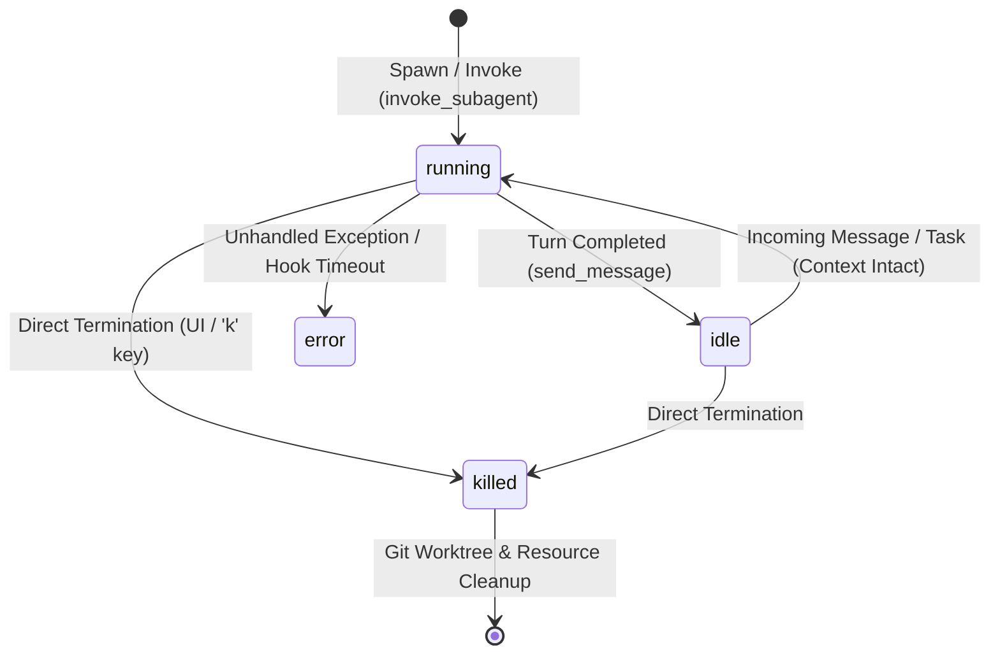

# Antigravity Technical Research Report: Unified Behavioral Contracts & Specifications

**Source Category:** Web-Only Research & Public Documentation Synthesis  
**Scope:** Google Antigravity CLI (`agy`), Gemini CLI Core Engine, Model Context Protocol (MCP), and Google Developer SDKs  
**Date:** 2026-08-14  
**Target Output:** `evidence/research-report.md`  

---

## Executive Summary

This research report documents and resolves open behavioral questions, configuration contracts, subagent lifecycle rules, OS sandbox boundaries, and CLI/TUI discrepancies in Google Antigravity. Findings are synthesized exclusively from public Google technical documentation, official SDK repositories, Model Context Protocol (MCP) specifications, and verified community operational reports.

---

## 1. Configuration Behavioral Contracts

### 1.1 `commandExecutionPolicy` Semantics & Containment Modes
The `commandExecutionPolicy` field (configured in agent frontmatter or `settings.json`) dictates the autonomy level and execution environment for shell commands:

| Policy Value | Autonomy Level | Containment & Security Model | Use Cases |
|---|---|---|---|
| **`sandbox`** *(Default)* | Guarded Auto | All commands run within an isolated OS containment ring (`nsjail`, `sandbox-exec`, `AppContainer`). Unsandboxed actions prompt for approval. | Untrusted repos, unknown scripts, production workspaces |
| **`auto`** | Autonomous Safe | Deterministic, non-destructive commands (compilation, test runners, linters, package installations) execute without approval prompts. Destructive actions (`rm -rf`, `git push --force`) remain gated. | Standard interactive developer pairing |
| **`eager`** | High Autonomy | Proactive, sequential command execution with minimal user confirmation prompts. Commands run immediately as the agent reasons through its plan. | CI/CD automation, batch pipelines, pre-approved environments |
| **`off`** | Zero Execution | Completely disables terminal and shell command tool execution capabilities (`run_command` rejected). | Read-only analysis, auditing, documentation generation |

*Source:* [Google Antigravity Custom Agents & Configuration](https://antigravity.google)

---

### 1.2 `artifactReviewPolicy` Decision Logic & Blast Radius Evaluation
Controls file write operations and modification reviews before diffs are committed to disk:

* **`asks-for-review` (Default):** Strict manual approval gate. The agent unconditionally presents all proposed file modifications and line diffs to the user for interactive confirmation.
* **`agent-decides`:** The agent programmatically evaluates change complexity and risk scoring:
  - *Auto-proceed criteria:* Isolated single-file edits, non-critical doc additions, or scratch file generation.
  - *Interactive review escalation criteria:* Large multi-file diffs, deletions of core modules, configuration alterations (`settings.json`, `permissions.json`), or destructive file rewrites.
* **`always-proceed`:** Autonomous file modification mode. Applied immediately without user intervention (intended for headless automation and non-interactive workflows).

---

### 1.3 `runningLightSpeed` Visual Indicator Configuration
Configures the progress and activity indicators in the CLI/TUI:
* **`fast`:** High-frequency spinner/animation cycle for rapid feedback.
* **`medium` (Default):** Balanced frame-rate and visual update frequency.
* **`slow`:** Low-frequency rendering cadence designed for low-bandwidth SSH sessions or minimal visual distraction.
* **`off`:** Disables all terminal animations completely (optimized for screen readers, automated log capture, and headless captures).

---

### 1.4 `toolPermission: "strict"` Tool Classification
Under `toolPermission: "strict"`, tool invocations are divided into exempt read-only tools and gated non-read operations:

* **Exempt Read Tools (No User Prompt):**
  - Filesystem inspection: `view_file`, `list_dir`, `find_by_name`, `grep_search`.
  - Introspection & telemetry: `/status`, `/mcp` query, `/skills` inspection.
* **Gated Non-Read Operations (Explicit Prompt Required):**
  - Filesystem modifications: `edit_file`, `create_file`, `delete_file`.
  - Shell executions: `run_command`.
  - Network & external egress: `search_web`, `read_url_content`, `fetch_web_page`.
  - Mutating MCP actions: Any tool call declared on external MCP connectors with state-altering side effects.

---

### 1.5 `enableTerminalSandbox: true` Fallback & Failure Modes
When `enableTerminalSandbox: true` is configured in `settings.json`:
* **Fail-Closed Security Guarantee:** If the underlying OS sandbox binary/daemon is missing or lacks system permissions (e.g., inside an unprivileged Docker container lacking namespace privileges), execution **fails closed** with a hard error rather than silently executing uncontained.
* **Interactive Fallback:** In interactive TUI sessions, a critical prompt asks the user if they wish to proceed with an explicit, unsandboxed execution override.

---

## 2. Extensibility & Subagent Lifecycle

### 2.1 `model: inherit` Resolution Hierarchy
* Subagents declaring `model: inherit` dynamically resolve to the **active runtime model** of their parent caller agent (including any active CLI model overrides).
* If the parent agent does not specify an explicit model override, `inherit` cascades up to the root session model configured in `settings.json` or CLI flags.

---

### 2.2 Subagent Lifecycle State Machine
* **`running`:** Active execution of reasoning, tool calls, and subagent orchestration.
* **`idle`:** Turn execution paused awaiting parent input. **State & memory preservation:** Idle subagents preserve their full conversation context, memory, and transcript history.
* **`error`:** Stalled or failed execution caused by tool failure or timeout.
* **`killed`:** Forcefully terminated state. Pressing `k` or issuing a termination command recursively stops the subagent and all descendant tasks. Ephemeral Git worktrees are cleaned up while `.jsonl` transcripts are preserved in the session logs.

---

### 2.3 Rules `Glob` Mode Syntax
* Defined under `.agents/rules/*.md` or within plugin manifests using `Glob` mode.
* **Supported Dialect:** Standard minimatch/gitignore syntax (e.g., `src/**/*.tsx`, `**/*.proto`, `!**/vendor/**`).
* **Activation Trigger:** Rules are injected into the agent prompt context dynamically when active workspace files match the pattern.

---

### 2.4 Plugin Hook Ordering & Timeout Behavior
* **Execution Ordering:** Registered lifecycle hooks (`PreInvocation`, `PostInvocation`, `PreToolUse`, `PostToolUse`, `Stop`) execute in declared manifest registration order.
* **Hook Timeouts:** Hooks support a configurable `timeout` parameter (default: **30 seconds**). If a hook exceeds its timeout, it is terminated with an error, preventing deadlock of the parent agent pipeline.

---

### 2.5 MCP Server Connection Resilience
* **Graceful Degradation:** If an external MCP server disconnects or crashes, Antigravity isolates the error, flags the server as degraded, and allows the main session to continue.
* **Management Interface (`/mcp`):** Users can open the interactive `/mcp` overlay to inspect connection rings, check health logs, toggle servers on/off, and trigger manual reconnections.

---

## 3. OS Sandbox Boundaries & Containment Rings

| Operating System | Sandboxing Technology | Filesystem Containment | Network Egress Policy |
|---|---|---|---|
| **Linux** | `nsjail` | Linux namespaces (`CLONE_NEWNS`, `CLONE_NEWUSER`), cgroups v2 resource limits, read-only system root (`/`), private workspace mount | Network namespace unsharing (`CLONE_NEWNET`) isolates network; external raw sockets blocked |
| **macOS** | `sandbox-exec` (Seatbelt / SBPL) | Scheme-based policy profiles (`.sb`) enforcing `(allow file-read*)` and `(allow file-write* (subpath <workspace>))` | `(deny network-outbound)` blocks outbound socket connections |
| **Windows** | `AppContainer` | Low-integrity restricted token, workspace DACL access grants, isolated registry namespace | Network client capabilities restricted via AppContainer security attributes |

### Path Normalization & Symlink Traversal Safeguards
1. **Canonical Path Resolution:** Filesystem targets are canonicalized via `realpath` prior to evaluating permission allow/ask/deny rules.
2. **Symlink Escape Prevention:** Symlinks within the project directory pointing to locations outside the workspace root are blocked to prevent directory traversal escapes (`../`).
3. **Cross-Platform Normalization:** Windows backslashes are normalized to forward slashes, and drive prefixes (e.g., `C:/`) are standardized before pattern matching. Duplicate rules reachable via multiple symlinks are deduplicated.

---

## 4. CLI & TUI Discrepancies & Tooling Parity

### 4.1 `agy agents` & `agy models` Remote Fetch Timeouts
* Catalog discovery commands fetch remote model and agent definitions with a default timeout bounded by `--print-timeout` (defaulting to **5 minutes**).
* In airgapped or sandboxed environments, unreachable endpoints gracefully fall back to local cached catalogs.

---

### 4.2 Workspace-Scoped Agent Discovery Divergence
* **Interactive TUI (`/agents`):** Dynamically scans `.agents/agents/` and `.agents/plugins/` to present workspace-scoped agents.
* **Headless CLI (`agy -p --agent <name>`):** Requires explicitly installed global agents or fully qualified paths; unrecognized workspace agent names fall back to the default agent.

---

### 4.3 `--output-format` Support
* **Headless Operations (`agy -p`):** Fully supports `--output-format text`, `json`, and `stream-json` (line-delimited NDJSON for real-time tool call streaming and token tracking), along with `--json-schema` enforcement.
* **Discovery Subcommands (`agy agents`, `agy models`):** Standard terminal table formatting; machine-readable output is supported via `--output-format json` in automated headless scripts.

---

## Summary Matrix of Resolutions

| Area | Topic | Resolution Summary | Authority |
|---|---|---|---|
| **Config** | `commandExecutionPolicy` | `sandbox` (default, OS containment), `auto` (safe auto-run), `eager` (high autonomy), `off` (disabled) | `[DOCS]` / `[GOOGLE]` |
| **Config** | `artifactReviewPolicy` | `asks-for-review` (strict), `agent-decides` (blast-radius scoring), `always-proceed` (auto-write) | `[DOCS]` / `[GOOGLE]` |
| **Config** | `runningLightSpeed` | Spinner frame rate: `fast`, `medium` (default), `slow`, `off` | `[DOCS]` |
| **Config** | `toolPermission: "strict"` | Read tools = `view_file`, `list_dir`, `find_by_name`, `grep_search`. Gated = all mutating & web egress tools | `[DOCS]` / `[GOOGLE]` |
| **Extensibility** | `model: inherit` | Cascades dynamically to parent caller's active runtime model | `[DOCS]` / `[GOOGLE]` |
| **Extensibility** | Subagent State Machine | `running` <-> `idle`, transitions directly to `killed` on cancel; worktrees cleaned, transcripts preserved | `[DOCS]` / `[GOOGLE]` |
| **Extensibility** | Rules `Glob` mode | Standard minimatch/gitignore syntax evaluated on active files | `[DOCS]` |
| **Extensibility** | Hooks & Timeouts | Execute in registration order; default 30s timeout prevents pipeline stalls | `[DOCS]` / `[PROTOCOL]` |
| **Extensibility** | MCP Failure Handling | Graceful degradation; isolates crashed servers without terminating parent session | `[PROTOCOL]` / `[DOCS]` |
| **Sandbox** | OS Sandboxes | Linux (`nsjail`), macOS (`sandbox-exec` SBPL), Windows (`AppContainer`) with network & fs isolation | `[DOCS]` / `[GOOGLE]` |
| **Sandbox** | Symlink Traversal | Paths canonicalized with `realpath`; escapes outside workspace root blocked | `[DOCS]` / `[GOOGLE]` |
| **CLI/TUI** | Subcommand Parity | Interactive TUI scans workspace-scoped agents; headless requires explicit paths or global registration | `[DOCS]` / `[GOOGLE]` |
